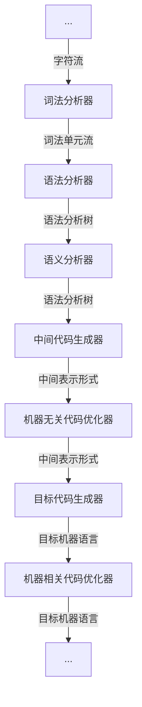
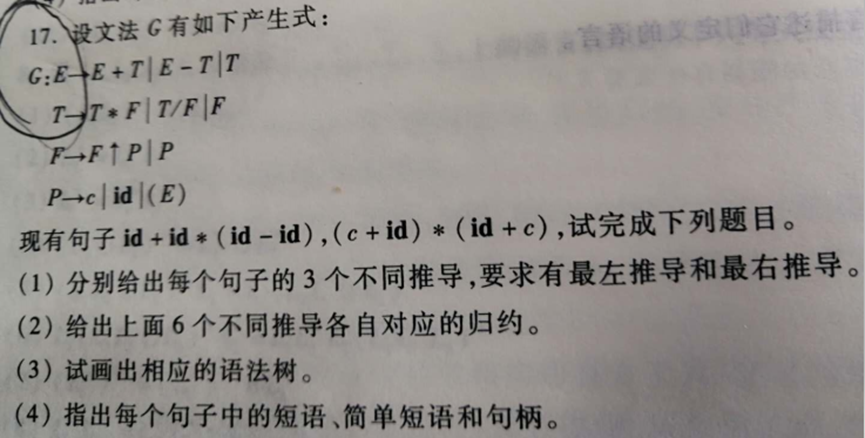
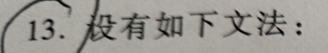
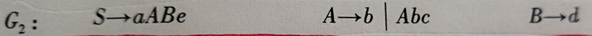
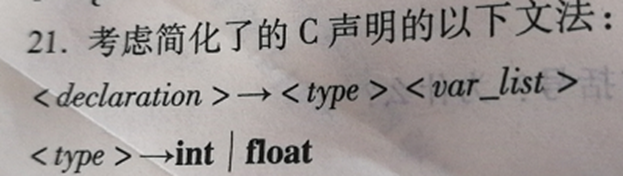
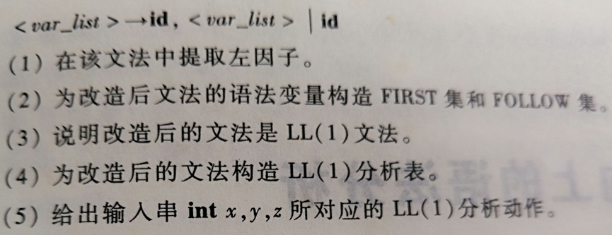

# 作业1

## 第一章

### 第1题

1. *画出编译器的总体结构，简要说明每个模块的功能。*



- 词法分析：从左向右逐行扫描源程序的字符，识别出各个单词，确定单词的类型。将识别出的单词转换成统一的词法单元形式（token）
- 语法分析：从token序列中识别出各类短语，并构造语法分析树
- 语义分析：分析由语法分析器识别出来的语法成分的语义，获取标识符的属性，进行语义检查，进行子程序和变量的静态绑定
- 中间代码生成：生成简单规范、与机器无关、易于优化与转换的中间代码
- 代码优化：为改进代码进行等价程序变换，使其运行得更快一些、占用空间更少一些
- 目标代码生成：将中间表示形式映射成目标机上的机器指令代码或汇编代码
- 表格管理： 管理各种符号表，辅助语法检查、语义检查，完成静态绑定，为编译的各个阶段提供信息
- 错误管理：进行各种错误的检查、报告、纠正，以及相应的续编译处理


### 第2题

2. *A机器上有一个C语言编译器，现要在B机器上实现一个新语言NEW的编译器，如何实现？（用T形图表达）*

   1. 首先得到工具：用A机器语言实现的编译程序将C语言编译成B机器语言

   ```
     -------------        -------------         
     |C语言   B机器|       |C语言   B机器|           
     ----     ----        ----     ----        
        |C语言| ------------- |A机器|
        	    |C语言   A机器|
        	    ----     ----
        		    |A机器|
   ```

   2. 然后利用工具完成任务：
      1. 用C语言实现的编译程序将NEW语言编译成B机器语言
      2. 用步骤1得到的工具将C语言实现的编译程序编译面B机器语言
   
   
   ```
    -------------        -------------         
   |NEW语言   B机器|     |NEW语言   B机器|           
    ----     ----        ----     ----        
       |C语言| ------------- |B机器|
        	   |C语言   B机器|
        	   ----     ----
        		   |A机器|
   ```
   


## 第二章



> 本题来自课本第二章课后第17题，语法树只需要画最左推导的语法树

### （1）

- $id+id*(id-id)$

  - 最左推导
    $$
    \begin{align}
    E&\Rarr E+T\\
    &\Rarr T+T\\
    &\Rarr F+T\\
    &\Rarr P+T\\
    &\Rarr id+T\\
    &\Rarr id+T*F\\
    &\Rarr id+F*F\\
    &\Rarr id+P*F\\
    &\Rarr id+id*F\\
    &\Rarr id+id*P\\
    &\Rarr id+id*(E)\\
    &\Rarr id+id*(E-T)\\
    &\Rarr id+id*(T-T)\\
    &\Rarr id+id*(F-T)\\
    &\Rarr id+id*(P-T)\\
    &\Rarr id+id*(id-T)\\
    &\Rarr id+id*(id-F)\\
    &\Rarr id+id*(id-P)\\
    &\Rarr id+id*(id-id)\\
    \end{align}
    $$

  - 最右推导
    $$
    \begin{align}
    E&\Rarr E+T\\
    &\Rarr E+T*F\\
    &\Rarr E+T*P\\
    &\Rarr E+T*(E)\\
    &\Rarr E+T*(E-T)\\
    &\Rarr E+T*(E-F)\\
    &\Rarr E+T*(E-P)\\
    &\Rarr E+T*(E-id)\\
    &\Rarr E+T*(T-id)\\
    &\Rarr E+T*(F-id)\\
    &\Rarr E+T*(P-id)\\
    &\Rarr E+T*(id-id)\\
    &\Rarr E+F*(id-id)\\
    &\Rarr E+P*(id-id)\\
    &\Rarr E+id*(id-id)\\
    &\Rarr T+id*(id-id)\\
    &\Rarr F+id*(id-id)\\
    &\Rarr P+id*(id-id)\\
    &\Rarr id+id*(id-id)\\
    \end{align}
    $$

  - 其他推导方式
    $$
    \begin{align}
    E&\Rarr E+T\\
    &\Rarr E+T*F\\
    &\Rarr E+T*P\\
    &\Rarr E+T*(E)\\
    &\Rarr E+T*(E-T)\\
    &\Rarr T+T*(E-T)\\
    &\Rarr F+T*(E-T)\\
    &\Rarr P+T*(E-T)\\
    &\Rarr id+T*(E-T)\\
    &\Rarr id+F*(E-T)\\
    &\Rarr id+P*(E-T)\\
    &\Rarr id+id*(E-T)\\
    &\Rarr id+id*(T-T)\\
    &\Rarr id+id*(F-T)\\
    &\Rarr id+id*(P-T)\\
    &\Rarr id+id*(id-T)\\
    &\Rarr id+id*(id-F)\\
    &\Rarr id+id*(id-P)\\
    &\Rarr id+id*(id-id)\\
    \end{align}
    $$
    

- $(c+id)*(id+c)$

  - 最左推导
    $$
    \begin{align}
    E&\Rarr T\\
    &\Rarr T*F\\
    &\Rarr F*F\\
    &\Rarr P*F\\
    &\Rarr (E)*F\\
    &\Rarr (E+T)*F\\
    &\Rarr (T+T)*F\\
    &\Rarr (F+T)*F\\
    &\Rarr (P+T)*F\\
    &\Rarr (c+T)*F\\
    &\Rarr (c+F)*F\\
    &\Rarr (c+P)*F\\
    &\Rarr (c+id)*F\\
    &\Rarr (c+id)*P\\
    &\Rarr (c+id)*(E)\\
    &\Rarr (c+id)*(E+T)\\
    &\Rarr (c+id)*(T+T)\\
    &\Rarr (c+id)*(F+T)\\
    &\Rarr (c+id)*(P+T)\\
    &\Rarr (c+id)*(id+T)\\
    &\Rarr (c+id)*(id+F)\\
    &\Rarr (c+id)*(id+P)\\
    &\Rarr (c+id)*(id+c)\\
    \end{align}
    $$

  - 最右推导
    $$
    \begin{align}
    E&\Rarr T\\
    &\Rarr T*F\\
    &\Rarr T*P\\
    &\Rarr T*(E)\\
    &\Rarr T*(E+T)\\
    &\Rarr T*(E+F)\\
    &\Rarr T*(E+P)\\
    &\Rarr T*(E+c)\\
    &\Rarr T*(T+c)\\
    &\Rarr T*(F+c)\\
    &\Rarr T*(P+c)\\
    &\Rarr T*(id+c)\\
    &\Rarr F*(id+c)\\
    &\Rarr P*(id+c)\\
    &\Rarr (E)*(id+c)\\
    &\Rarr (E+T)*(id+c)\\
    &\Rarr (E+F)*(id+c)\\
    &\Rarr (E+P)*(id+c)\\
    &\Rarr (E+id)*(id+c)\\
    &\Rarr (T+id)*(id+c)\\
    &\Rarr (F+id)*(id+c)\\
    &\Rarr (P+id)*(id+c)\\
    &\Rarr (c+id)*(id+c)\\
    \end{align}
    $$

  - 其他推导方式
    $$
    \begin{align}
    E&\Rarr T\\
    &\Rarr T*F\\
    &\Rarr T*P\\
    &\Rarr T*(E)\\
    &\Rarr T*(E+T)\\
    &\Rarr F*(E+T)\\
    &\Rarr P*(E+T)\\
    &\Rarr (E)*(E+T)\\
    &\Rarr (E+T)*(E+T)\\
    &\Rarr (T+T)*(E+T)\\
    &\Rarr (F+T)*(E+T)\\
    &\Rarr (P+T)*(E+T)\\
    &\Rarr (c+T)*(E+T)\\
    &\Rarr (c+F)*(E+T)\\
    &\Rarr (c+P)*(E+T)\\
    &\Rarr (c+id)*(E+T)\\
    &\Rarr (c+id)*(T+T)\\
    &\Rarr (c+id)*(F+T)\\
    &\Rarr (c+id)*(P+T)\\
    &\Rarr (c+id)*(id+T)\\
    &\Rarr (c+id)*(id+F)\\
    &\Rarr (c+id)*(id+P)\\
    &\Rarr (c+id)*(id+c)\\
    \end{align}
    $$

### （2）

- $id+id*(id-id)$

  - 最左推导对应的最右规约
    $$
    \begin{align}
    &id+id*(id-id)\\
    &id+id*(id-P)\Rarr\\
    &id+id*(id-F)\Rarr\\
    &id+id*(id-T)\Rarr\\
    &id+id*(P-T)\Rarr\\
    &id+id*(F-T)\Rarr\\
    &id+id*(T-T)\Rarr\\
    &id+id*(E-T)\Rarr\\
    &id+id*(E)\Rarr\\
    &id+id*P\Rarr\\
    &id+id*F\Rarr\\
    &id+P*F\Rarr\\
    &id+F*F\Rarr\\
    &id+T*F\Rarr\\
    &id+T\Rarr\\
    &P+T\Rarr\\
    &F+T\Rarr\\
    &T+T\Rarr\\
    &E+T\Rarr\\
    &E\Rarr\\
    \end{align}
    $$

  - 最右推导对应的最左归约
    $$
    \begin{align}
    &id+id*(id-id)\\
    &P+id*(id-id)\Rarr\\
    &F+id*(id-id)\Rarr\\
    &T+id*(id-id)\Rarr\\
    &E+id*(id-id)\Rarr\\
    &E+P*(id-id)\Rarr\\
    &E+F*(id-id)\Rarr\\
    &E+T*(id-id)\Rarr\\
    &E+T*(P-id)\Rarr\\
    &E+T*(F-id)\Rarr\\
    &E+T*(T-id)\Rarr\\
    &E+T*(E-id)\Rarr\\
    &E+T*(E-P)\Rarr\\
    &E+T*(E-F)\Rarr\\
    &E+T*(E-T)\Rarr\\
    &E+T*(E)\Rarr\\
    &E+T*P\Rarr\\
    &E+T*F\Rarr\\
    &E+T\Rarr\\
    &E\Rarr\\
    \end{align}
    $$

  - 其他推导方式对应的规约
    $$
    \begin{align}
    &id+id*(id-id)\\
    &id+id*(id-P)\Rarr\\
    &id+id*(id-F)\Rarr\\
    &id+id*(id-T)\Rarr\\
    &id+id*(P-T)\Rarr\\
    &id+id*(F-T)\Rarr\\
    &id+id*(T-T)\Rarr\\
    &id+id*(E-T)\Rarr\\
    &id+P*(E-T)\Rarr\\
    &id+F*(E-T)\Rarr\\
    &id+T*(E-T)\Rarr\\
    &P+T*(E-T)\Rarr\\
    &F+T*(E-T)\Rarr\\
    &T+T*(E-T)\Rarr\\
    &E+T*(E-T)\Rarr\\
    &E+T*(E)\Rarr\\
    &E+T*P\Rarr\\
    &E+T*F\Rarr\\
    &E+T\Rarr\\
    &E\Rarr\\
    \end{align}
    $$

- $(c+id)*(id+c)$

  - 最左推导对应的最右规约
    $$
    \begin{align}
    &(c+id)*(id+c)\\
    &(c+id)*(id+P)\Rarr\\
    &(c+id)*(id+F)\Rarr\\
    &(c+id)*(id+T)\Rarr\\
    &(c+id)*(P+T)\Rarr\\
    &(c+id)*(F+T)\Rarr\\
    &(c+id)*(T+T)\Rarr\\
    &(c+id)*(E+T)\Rarr\\
    &(c+id)*(E)\Rarr\\
    &(c+id)*P\Rarr\\
    &(c+id)*F\Rarr\\
    &(c+P)*F\Rarr\\
    &(c+F)*F\Rarr\\
    &(c+T)*F\Rarr\\
    &(P+T)*F\Rarr\\
    &(F+T)*F\Rarr\\
    &(T+T)*F\Rarr\\
    &(E+T)*F\Rarr\\
    &(E)*F\Rarr\\
    &P*F\Rarr\\
    &F*F\Rarr\\
    &T*F\Rarr\\
    &T\Rarr\\
    &E\Rarr\\
    \end{align}
    $$

  - 最右推导对应的最左规约
    $$
    \begin{align}
    &(c+id)*(id+c)\\
    &(P+id)*(id+c)\Rarr\\
    &(F+id)*(id+c)\Rarr\\
    &(T+id)*(id+c)\Rarr\\
    &(E+id)*(id+c)\Rarr\\
    &(E+P)*(id+c)\Rarr\\
    &(E+F)*(id+c)\Rarr\\
    &(E+T)*(id+c)\Rarr\\
    &(E)*(id+c)\Rarr\\
    &P*(id+c)\Rarr\\
    &F*(id+c)\Rarr\\
    &T*(id+c)\Rarr\\
    &T*(P+c)\Rarr\\
    &T*(F+c)\Rarr\\
    &T*(T+c)\Rarr\\
    &T*(E+c)\Rarr\\
    &T*(E+P)\Rarr\\
    &T*(E+F)\Rarr\\
    &T*(E+T)\Rarr\\
    &T*(E)\Rarr\\
    &T*P\Rarr\\
    &T*F\Rarr\\
    &T\Rarr\\
    &E\Rarr\\
    \end{align}
    $$

  - 其他推导方式对应的规约
    $$
    \begin{align}
    &(c+id)*(id+c)\\
    &(c+id)*(id+P)\Rarr\\
    &(c+id)*(id+F)\Rarr\\
    &(c+id)*(id+T)\Rarr\\
    &(c+id)*(P+T)\Rarr\\
    &(c+id)*(F+T)\Rarr\\
    &(c+id)*(T+T)\Rarr\\
    &(c+id)*(E+T)\Rarr\\
    &(c+P)*(E+T)\Rarr\\
    &(c+F)*(E+T)\Rarr\\
    &(c+T)*(E+T)\Rarr\\
    &(P+T)*(E+T)\Rarr\\
    &(F+T)*(E+T)\Rarr\\
    &(T+T)*(E+T)\Rarr\\
    &(E+T)*(E+T)\Rarr\\
    &(E)*(E+T)\Rarr\\
    &P*(E+T)\Rarr\\
    &F*(E+T)\Rarr\\
    &T*(E+T)\Rarr\\
    &T*(E)\Rarr\\
    &T*P\Rarr\\
    &T*F\Rarr\\
    &T\Rarr\\
    &E\Rarr\\
    \end{align}
    $$

### （3）

- $id+id*(id-id)$对应的语法树：

  ```mermaid
  graph TB
  1[E]-->2[E]
  1[E]-->3[+]
  1[E]-->4[T]
  2[E]-->5[T]
  5[T]-->6[F]
  6[F]-->7[P]
  7[P]-->8[id]
  4[T]-->9[T]
  4[T]-->10[*]
  4[T]-->11[F]
  9[T]-->12[F]
  12[F]-->13[P]
  13[P]-->14[id]
  11[F]-->15[P]
  15[P]-->16["("]
  15[P]-->17[E]
  15[P]-->18[")"]
  17[E]-->19[E]
  17[E]-->20[-]
  17[E]-->21[T]
  19[E]-->22[T]
  22[T]-->23[F]
  23[F]-->24[P]
  24[P]-->25[id]
  21[T]-->26[F]
  26[F]-->27[P]
  27[P]-->28[id]
  ```

- $(c+id)*(id+c)$对应的语法树：

  ```mermaid
  graph TB
  1[E]-->2[T]
  2[T]-->3[T]
  2[T]-->4[*]
  2[T]-->5[F]
  3[T]-->6[F]
  6[F]-->7[P]
  7[P]-->8["("]
  7[P]-->9[E]
  7[P]-->10[")"]
  9[E]-->11[E]
  9[E]-->12[+]
  9[E]-->13[T]
  11[E]-->14[T]
  14[T]-->15[F]
  15[F]-->16[P]
  16[P]-->17[c]
  13[T]-->18[F]
  18[F]-->19[P]
  19[P]-->20[id]
  5[F]-->21[P]
  21[P]-->22["("]
  21[P]-->23[E]
  21[P]-->24[")"]
  23[E]-->25[E]
  23[E]-->26[+]
  23[E]-->27[T]
  25[E]-->28[T]
  28[T]-->29[F]
  29[F]-->30[P]
  30[P]-->31[id]
  27[T]-->32[F]
  32[F]-->33[P]
  33[P]-->34[c]
  ```

### （4）

$id+id*(id-id)$：

- 短语：
  - $id$
  - $id-id$
  - $(id-id)$
  - $id*(id-id)$
  - $id+id*(id-id)$
- 简单短语：
  - $id$
- 句柄：
  - $id$


$(c+id)*(id+c)$：

- 短语：
  - $c$
  - $id$
  - $c+id$
  - $id+c$
  - $(c+id)$
  - $(id+c)$
  - $(c+id)*(id+c)$
- 简单短语：
  - $c$
  - $id$
- 句柄：
  - $c$


## 第三章


> 本题来自于课本第三章课后24题、25题

### 第24题

首先进行正则定义：
$$
digit\rarr0|1|2|...|9\\
letter\rarr a|b|...|z|A|B|...|Z
$$
则正则表达式为：
$$
letter(letter|digit)^*
$$


### 第25题

首先进行正则定义：
$$
digit\rarr0|1|2|...|9\\
letter\rarr a|b|...|z|A|B|...|Z
$$
则正则表达式为：
$$
letter(letter|digit)^*((-|.)(letter|digit)^+|\epsilon)
$$


## 第四章

> 本题来自课本第四章课后第13、21题，21题的分析动作按格局的方式给出

### 第13题






（1）：

- 消除左递归：
  $$
  将产生式A\rarr b|Abc替换为:\\
  A\rarr b A'\\
  A'\rarr bcA'|\epsilon \\
  $$

- 则改写的等价LL(1)文法为：
  $$
  S\rarr aABe\\
  A\rarr bA'\\
  A'\rarr bcA'|\epsilon\\
  B\rarr d
  $$
  

（2）：

| 文法符号 |    FIRST集     | FOLLOW集 |
| :------: | :------------: | :------: |
|    S     |      {a}       |   {$}    |
|    A     |      {b}       |   {d}    |
|    A’    | {b $\epsilon$} |   {d}    |
|    B     |      {d}       |   {e}    |
|    a     |      {a}       |    /     |
|    b     |      {b}       |    /     |
|    c     |      {c}       |    /     |
|    d     |      {d}       |    /     |
|    e     |      {e}       |    /     |

（3）：

|      |       a       |       b        |  c   |         d         |  e   |  $   |
| :--: | :-----------: | :------------: | :--: | :---------------: | :--: | :--: |
|  S   | $S\rarr aABe$ |                |      |                   |      |      |
|  A   |               |  $A\rarr bA'$  |      |                   |      |      |
|  A’  |               | $A'\rarr bcA'$ |      | $A'\rarr\epsilon$ |      |      |
|  B   |               |                |      |    $B\rarr d$     |      |      |


### 第21题





（1）：

对于产生式$<var\_list>\rarr id,<var\_list>|id$，提取左公因子后，替换为：
$$
<var\_list>\rarr id<common>\\
<common>\rarr,<var\_list>|\epsilon
$$
则改造后的文法为：
$$
<declaration>\rarr<type><var\_list>\\
<type>\rarr int|float\\
<var\_list>\rarr id<common>\\
<common>\rarr,<var\_list>|\epsilon
$$


（2）：

|    文法符号     |    FIRST集     | FOLLOW集 |
| :-------------: | :------------: | :------: |
| $<declaration>$ |  {int float}   |   {$}    |
|    $<type>$     |  {int float}   |   {id}   |
|  $<var\_list>$  |      {id}      |   {$}    |
|   $<common>$    | {, $\epsilon$} |   {$}    |
|       int       |     {int}      |    /     |
|      float      |    {float}     |    /     |
|       id        |      {id}      |    /     |
|        ,        |      {,}       |    /     |


（3）：

计算各产生式的SELECT集：

|                产生式                 |  SELECT集   |
| :-----------------------------------: | :---------: |
| $<declaration>\rarr<type><var\_list>$ | {int float} |
|           $<type>\rarr int$           |    {int}    |
|          $<type>\rarr float$          |   {float}   |
|     $<var\_list>\rarr id<common>$     |    {id}     |
|      $<common>\rarr,<var\_list>$      |     {,}     |
|        $<common>\rarr\epsilon$        |     {$}     |

具有相同左部的产生式：

- $<type>\rarr int$和$<type>\rarr float$，FOLLOW集分别为{int}和{float}，互不相交
- $$<common>\rarr,<var\_list>$$和$<common>\rarr\epsilon$$，FOLLOW集分别为{,}和{$}，互不相交

所以改造后的文法是LL(1)文法


（4）：

|                 |           int            |          float           |         id         |          ,          | $               |
| :-------------: | :----------------------: | :----------------------: | :----------------: | :-----------------: | --------------- |
| $<declaration>$ | $\rarr<type><var\_list>$ | $\rarr<type><var\_list>$ |                    |                     |                 |
|    $<type>$     |       $\rarr int$        |      $\rarr float$       |                    |                     |                 |
|  $<var\_list>$  |                          |                          | $\rarr id<common>$ |                     |                 |
|   \<common\>    |                          |                          |                    | $\rarr,<var\_list>$ | $\rarr\epsilon$ |


（5）：

格局如下表所示：

| 栈（栈底$\rarr$栈顶） |    剩余输入     |
| :-------------------: | :-------------: |
|   $\$<declaration>$   | int x , y , z $ |
| $\$<var\_list><type>$ | int x , y , z $ |
|  $\$<var\_list>int$   | int x , y , z $ |
|    $\$<var\_list>$    |   x , y , z $   |
|    $\$<common>id$     |   x , y , z $   |
|     $\$<common>$      |    , y , z $    |
|   $\$<var\_list>,$    |    , y , z $    |
|    $\$<var\_list>$    |     y , z $     |
|    $\$<common>id$     |     y , z $     |
|     $\$<common>$      |      , z $      |
|   $\$<var\_list>,$    |      , z $      |
|    $\$<var\_list>$    |       z $       |
|    $\$<common>id$     |       z $       |
|     $\$<common>$      |        $        |
|         $\$$          |        $        |


