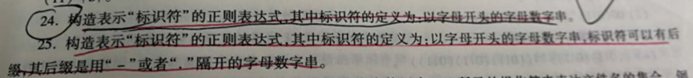
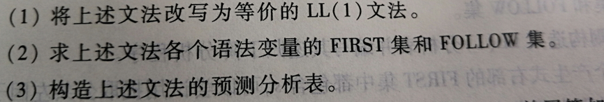

# 作业1

## 第一章

### 第1题

1. *画出编译器的总体结构，简要说明每个模块的功能。*


- 词法分析：从左向右逐行扫描源程序的字符，识别出各个单词，确定单词的类型。将识别出的单词转换成统一的词法单元形式（token）
- 语法分析：从token序列中识别出各类短语，并构造语法分析树
- 语义分析：分析由语法分析器识别出来的语法成分的语义，获取标识符的属性，进行语义检查，进行子程序和变量的静态绑定
- 中间代码生成：生成简单规范、与机器无关、易于优化与转换的中间代码
- 代码优化：为改进代码进行等价程序变换，使其运行得更快一些、占用空间更少一些
- 目标代码生成：将中间表示形式映射成目标机上的机器指令代码或汇编代码
- 表格管理： 管理各种符号表，辅助语法检查、语义检查，完成静态绑定，为编译的各个阶段提供信息
- 错误管理：进行各种错误的检查、报告、纠正，以及相应的续编译处理


### 第2题

2. *A机器上有一个C语言编译器，现要在B机器上实现一个新语言NEW的编译器，如何实现？（用T形图表达）*

   1. 首先得到工具：用A机器语言实现的编译程序将C语言编译成B机器语言

   ```
     -------------        -------------         
     |C语言   B机器|       |C语言   B机器|           
     ----     ----        ----     ----        
        |C语言| ------------- |A机器|
        	    |C语言   A机器|
        	    ----     ----
        		    |A机器|
   ```

   2. 然后利用工具完成任务：
      1. 用C语言实现的编译程序将NEW语言编译成B机器语言
      2. 用步骤1得到的工具将C语言实现的编译程序编译面B机器语言
   
   
   ```
    -------------        -------------         
   |NEW语言   B机器|     |NEW语言   B机器|           
    ----     ----        ----     ----        
       |C语言| ------------- |B机器|
        	   |C语言   B机器|
        	   ----     ----
        		   |A机器|
   ```
   


## 第二章


> 本题来自课本第二章课后第17题，语法树只需要画最左推导的语法树


## 第三章



> 本题来自于课本第三章课后24题、25题

### 第24题


### 第25题


## 第四章

> 本题来自课本第四章课后第13、21题，21题的分析动作按格局的方式给出

### 第13题





### 第21题


