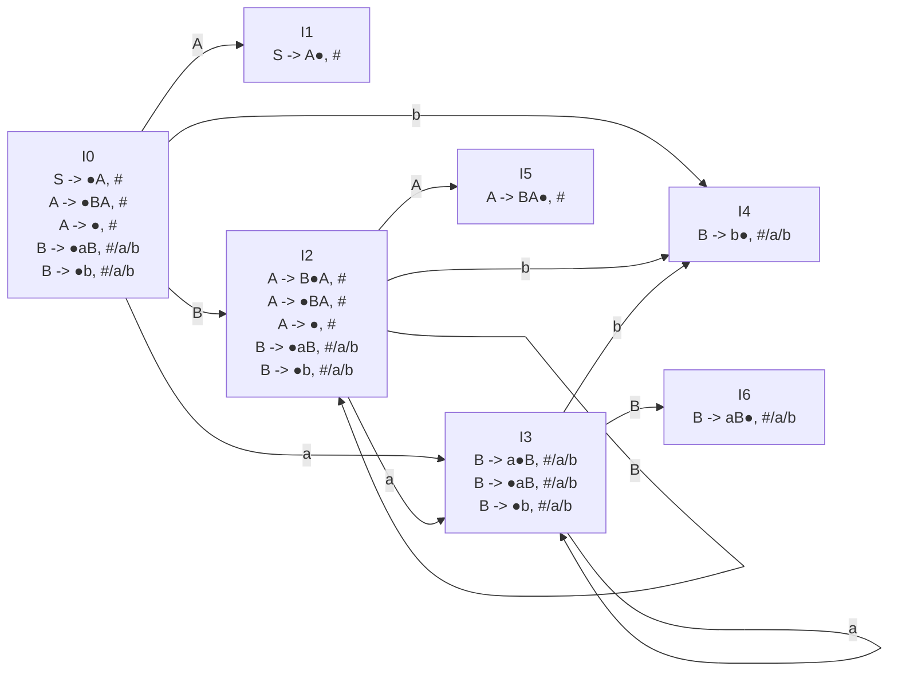
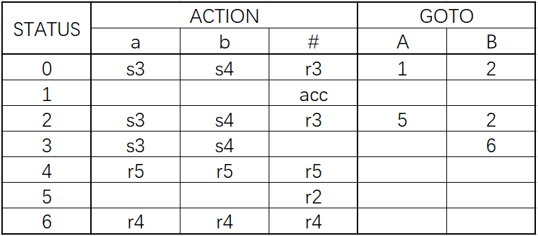

# 编译原理作业2

>   姓名：孙铎
>
>   学号：200110503

## 第5章

课本第5章第15题；

（1）：

开始符号`S`只出现在产生式`S -> A`的左部，符合**只有一个接收状态**的要求，所以不使用增广文法。

产生式编号为：

1.   `S -> A`
2.   `A -> BA`
3.   `A -> ε`
4.   `B -> aB`
5.   `B -> b`

需要的FIRST集：

-   `FIRST(A)={ε,a,b}`

文法G的LR(1)自动机/项目集为：

（2）：

构造G的LR(1)分析表：

（3）：

输入符号串`w=abab`的自底向上语法分析过程为：

| 状态栈(栈底$\rarr$栈顶) | 符号栈(栈底$\rarr$栈顶) | 输入缓冲(自左向右读取) | ACTION | GOTO |
| :---------------------: | :---------------------: | :--------------------: | :----: | :--: |
|            0            |            #            |         abab#          |   s3   |      |
|           03            |           #a            |          bab#          |   s4   |      |
|           034           |           #ab           |          ab#           |   r5   |  6   |
|           036           |           #aB           |          ab#           |   r4   |  2   |
|           02            |           #B            |          ab#           |   s3   |      |
|           023           |           #Ba           |           b#           |   s4   |      |
|          0234           |          #Bab           |           #            |   r5   |  6   |
|          0236           |          #BaB           |           #            |   r4   |  2   |
|           022           |           #BB           |           #            |   r3   |  5   |
|          0225           |          #BBA           |           #            |   r2   |  5   |
|           025           |           #BA           |           #            |   r2   |  1   |
|           01            |           #A            |           #            |  acc   |      |

## 第7章

课本第7章第22题第（1）小题；

语句的三地址码为：

1.   `if a < c goto 3`
2.   `goto 15`
3.   `if b < d goto 5`
4.   `goto 15`
5.   `if a = 1 goto 7`
6.   `goto 10`
7.   `t1 := c + 1`
8.   `c := t1`
9.   `goto 1`
10.   `if a <= d goto 12`
11.   `goto 1`
12.   `t2 := a + 2`
13.   `a := t2`
14.   `goto 10`
15.   

对应的四元式序列为：

1.   `(j<, a, c, 3)`
2.   `(j, -, -, 15)`
3.   `(j<, b, d, 5)`
4.   `(j, -, -, 15)`
5.   `(j=, a, 1, 7)`
6.   `(j, -, -, 10)`
7.   `(=, c, 1, t1)`
8.   `()`

## 第9章

课本第9章第8题；

## 第11章

课本第11章第2题；

