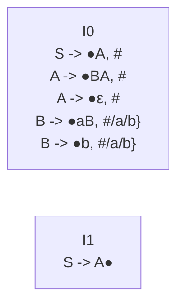

# 编译原理作业2

>   姓名：孙铎
>
>   学号：200110503

## 第5章

课本第5章第15题；

（1）：

开始符号`>`只出现在产生式`S -> A`的左部，符合只有一个接收状态的要求。

FIRST集：

-   `FIRST(A)={ε,a,b}`

文法G的LR(1)项目集为：

## 第7章

课本第7章第22题第（1）小题；

## 第9章

课本第9章第8题；

## 第11章

课本第11章第2题；

