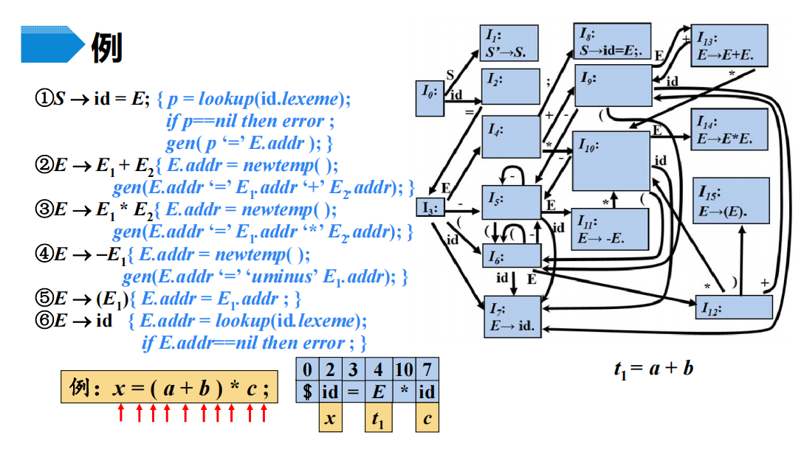
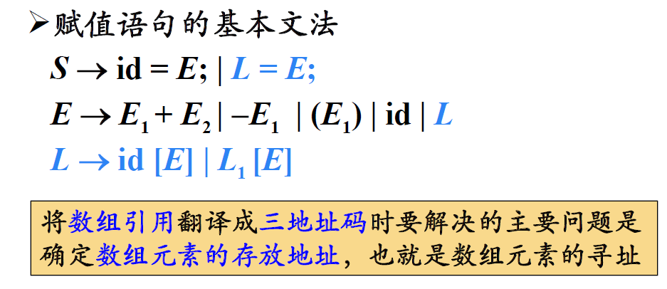
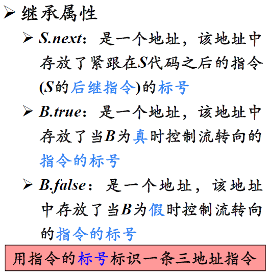
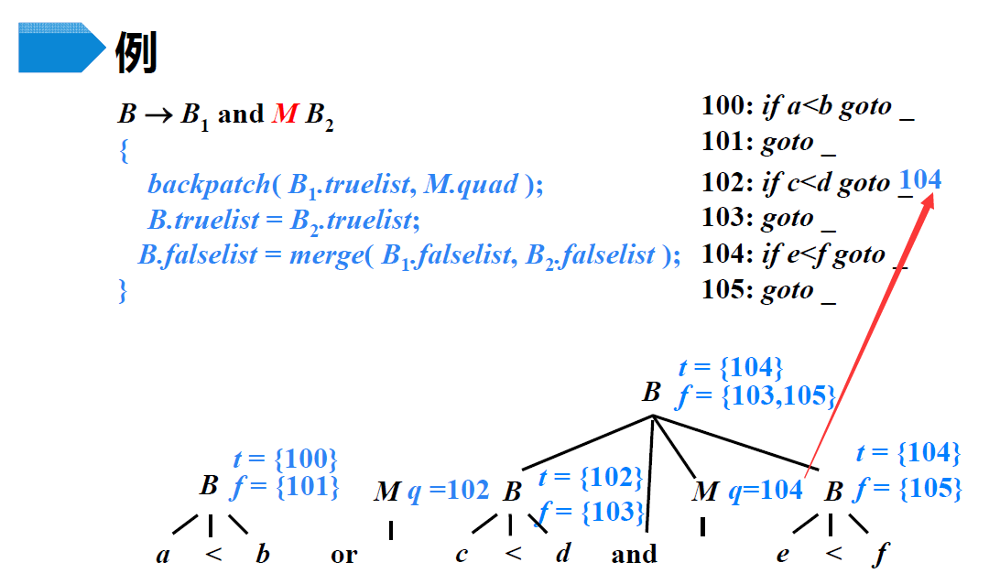
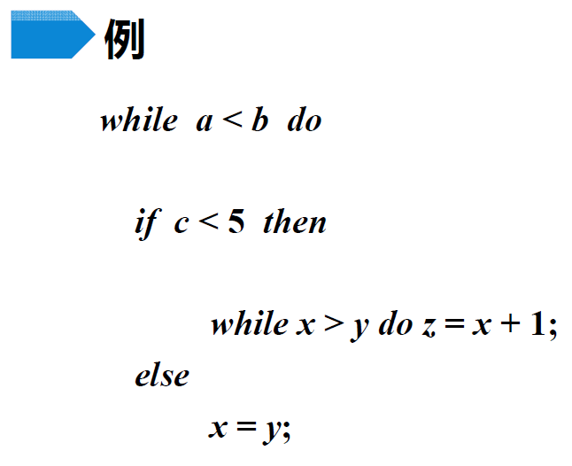

# 中间代码生成

>   各类语句的翻译，声明、赋值、控制、过程调用......

> 为什么产生式能代表那么多含义？这是由产生式的**应用场景**决定的。在编译原理中，要能给各条产生式赋予合理的**应用**意义

## 1 声明语句的翻译

主要任务：

### 1.1 类型表达式 Type Expressions

#### 1.1.1 基本类型

#### 1.1.2 类型名

#### 1.1.3 类型构造符

<u>数组构造符`array`</u>

---

<u>指针构造符`pointer`</u>

---

<u>笛卡尔乘积构造符$\times$</u>

---

<u>函数构造符$\rarr$</u>

-   $T_i$相当于参数
-   $R$相当于返回值

---

<u>记录构造符`record`</u>

-   n个字段，每个字段的名字、标识符是$N_i$，每个字段的类型是$T_i$

#### 1.1.4 类型表达式的绑定

举例：

### 1.2 局部变量的存储分配

-   由类型表达式得知类型宽度
-   根据宽度分配相对地址
-   还要管理符号表

---

文法举例：

-   需要收集类型、宽度，因而定义这样的属性

    

-   特殊的变量：

    

    -   `offset`有初始值，这里为0
    -   `t, w`的作用在下面的例子中介绍

-   副作用`enter`：每当识别出一个声明后，就创建一条记录

    

    >   建立记录后`offset`就要后移了

---

文法识别过程举例：

>   当然，首先要验证，相同左部相同的产生式的SELECT集互不相交

基本类型举例：

1.   从开始符号推导，动作符在栈顶，执行动作，`offset`设置为0，动作出栈

     

2.   根据输入推导D

     

3.   根据输入推导T

     

4.   根据输入推导B，可以读取输入并出栈`real`

     

5.   执行语义动作a，计算B的综合属性

     

6.   执行语义动作a，给t和w赋值，其实是在传递值

     

7.   根据输入推导C

     

8.   执行语义动作a，给C的综合属性赋值，其实是通过t和w保存的值来完成的，对应着之前说的传递

     

9.   执行语义动作a，计算T的综合属性

     

10.   `id ;`匹配输入，出栈

11.   执行语义动作a，在符号表中建立记录

      

12.   根据输入推导D

      

13.   根据输入推导T

      

14.   根据输入推导B

      

15.   匹配`int`

      

16.   执行语义动作a，计算B的综合属性

      

17.   执行语义动作a，给t和w赋值，其实是在传递值

      

18.   根据输入推导C、执行动作传递值给C的综合属性

      

19.   `id ;`匹配输入，出栈

      

20.   执行语义动作，在符号表中建立记录，结束

      

---

数组类型举例：

-   主要关注数组类型的形成和宽度的计算
-   体会t和w在传递类型和宽度中的作用

## 2 简单赋值语句的翻译

主要任务：

-   表达式的值需要通过三地址码计算

三地址码举例：

> 就是要通过SDT，解析源程序片段，生成这样的三地址码（中间表示形式）

### 2.1 赋值语句的SDT

-   `code`用于记录三地址码，`addr`用于记录表达式值的存放地址

-   表达式值的存放地址往往就是符号表中记录的地址，通过`lookup`就可以获得。一般包括两类：

    -   源操作数对应的$E\rarr id$
    -   目标操作数对应的$S\rarr id=E$

-   不涉及计算的产生式三地址码属性`code`为空即可

-   涉及到计算，有新值产生，就需要`newtemp`存放值，同时要通过`gen(code)`生成三地址码，拼接`code`

    >   `||`代表连接运算

    -   这里虽然叫做`temp`，但还是要放在**三地址码**中，只是逻辑上起“临时”的作用

增量翻译：

-   增量翻译中不需要再用`||`拼接三地址码，直接让`gen`函数**生成三地址指令再拼接**即可

举例解释此SDT：

1.   不断移进，直到第一次归约

     

2.   第一次归约时，直接将`a`给到非终结符E的属性，这里a就直接代表地址了。然后继续归约

     

3.   第二次归约时，也直接将`b`给到非终结符E的属性。然后用第二条产生式归约，生成一条三地址指令，`newtemp()`的结果由`t1`体现

     

4.   第5条产生式归约

     

5.   标识符归约、乘法运算归约，同样调用`newtemp`

     

     

6.   移入至规约状态，第一条产式规约

     

     

     这样就生成了需要的**三地址码**

### 2.2 带数组引用的翻译

*带数组引用的基本文法：*

重点：**数组寻址**问题

---

*数组元素寻址：*

举例：

---

*翻译目标：*

- 元素寻址的计算过程也是目标三地址码的一部分

---

*数组引用的SDT：*

重点：将地址计算公式与数组引用的文法关联起来

举例：

- 最初`type`函数通过查询符号表可以得知a的类型，然后`type`属性的计算就可以通过**子结点**得到
- `offset`是偏移地址，也会延续子结点不断计算
- `array`是基地址，直接从子结点传上来

数组引用的SDT：

- `.elem`就相当于向深取一层数组元素类型了
- 在计算深层次偏移量时，有两部分组成，一部分是子结点的偏移量，另一部分是这里用宽度新计算的量

## 3 控制流语句及其SDT

> 这个小节的结构可用于总结

### 3.1 控制流语句的基本文法和代码结构

*基本文法：*

- 赋值
- 分支
- 循环

*代码结构：*

- 继承属性：

  - `S.next`是整个语句块的下一条指令，所以由`S`推导出的`S`都会继承`next`，因为它们都属于整个语句块

  - `B.true`和`B.false`其实就是两种不同的跳转

    

### 3.2 控制流语句的SDT

- `next`作为继承属性，保留的是地址，对地址的赋值往往在之后进行
  - `next`属性的赋值时机值得注意
- `label`函数的作用就是将**下一条指令标号**给到出参

> 赋值语句的翻译方案已经讲过，接下来重点讲分支和循环语句

- 注意`next`的继承
- 三地址码的生成

- 这里需要不断循环，所以用`begin`继承属性记录第一条语句标号。这里所说的第一条语句其实是布尔表达式的判断，所以`S.next`和`B.true`不一样

## 4 布尔表达式及其SDT

### 4.1 基本文法和代码结构

### 4.2 SDT

- 认为布尔表达式是表达式通过`relop`的连接

- 这里还是注意之前的问题，`B1.false`要存的是下一条代码标号，而不是存布尔表达式，所以要等到后面赋值，也就是`B2`之前

### 4.3 控制流语句翻译实例

- 该文法不是LL(1)的
- 该文法虽然是LR的，但右部内嵌了语义动作

:star:SDT的通用实现方法：

语法分析树：

执行语义动作：

- 对于整个语句块，先记录下一条语句标号，当然这里只执行了`S.next=newlabel()`，后面的`label(S.next)`要等整个语句分析完才行

- 第一条布尔表达式，主要生成语句的跳转逻辑
- 循环体内部的整体，先确定整体**下一条语句**的位置，**继承**过来的

- 这里对于布尔表达式和算术表达式的执行动作省略了，可以看之前几节

三地址码的分析：

## 5 回填(Backpatching)

> 回填什么？回填跳转指令要跳去的标号
>
> 其实就是从归约的角度来看，将标号转变为综合属性

将由**跳转指令生成的列表**通过**综合属性**进行传递（就不用`next true false`这种**继承属性**了）

基本思想：

### 5.1 布尔表达式的回填

*布尔符号B新增的综合属性：*

- `truelist`的意思是，那些`goto`要跳到这个真出口来，至于真出口是多少，需要归约之后再回填

*新增的函数：*

- 这里的`i`是跳转指令，是`goto ...`整体，而不是要`goto`到的目标

*布尔表达式回填的SDT：*

- `nextquad`是即将生成的下一条指令的标号，指的就是`if E.addr relop E.addr goto _`，这里`makelist(nextquad)`直接将下一条指令放到了`list`中，因为下一条指令要跳转到的地方是需要回填的

- `M`是为了记下`B2`第一条指令的标号，从而实现之后对`B1`的回填，也就是在归约完成之后的回填

*举例：*

- 注意，`and`的优先级更高，所以接下来要移入`and`

- 注意这里的`backpatch`和`merge`

- 剩下的一对真出口和假出口需要等B归约之后确定了再回填

### 5.2 控制流语句的回填

*文法与综合属性：*

- `S.nextlist`中的`goto`最终都要跳到`S`的下一条指令，那`S`的下一条指令具体是什么，要等之后求出来再回填

---

*SDT：*

- 要用`S1`的第一条指令回填`B.truelist`，所以需要用`M`记录

- `M1 M2`用来回填`truelist`
- `N`用来生成跳转指令

- 如果分不清谁该赋值给谁，可以想想这是综合属性还是继承属性

  > 其实学到这里也更能理解“综合”的含义了，就是要综合所有子结点的信息，才能完整计算出来的

- `S S1`作为代表语句块的非终结符，本身就有`nextlist`属性，这里表面上看不出`S1.nextlist`的作用，但其实有用，比如，如果`S1`本身是一个条件判断语句块，其中的语句就需要用到`S1.nextlist`，直接跳转回`B.code`，就不用再走到下面`goto`再去跳转了。当然，也有可能完全用不到`S1.nextlist`，这时就直接为空`nil`

- 如果已经明确了是赋值语句，直接让其`nextlist`为空即可，因为`S`之中没有必须要跳转到`S.next`的语句，只是顺序执行

*翻译举例：*

