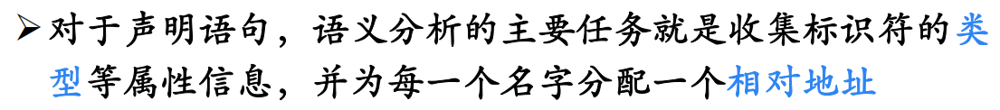
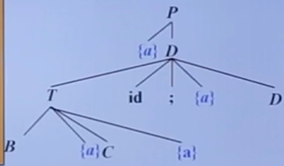

# 中间代码生成

>   各类语句的翻译，声明、赋值、控制、过程调用......

## 1 声明语句的翻译

主要任务：

### 1.1 类型表达式 Type Expressions

#### 1.1.1 基本类型

#### 1.1.2 类型名

#### 1.1.3 类型构造符

<u>数组构造符`array`</u>

---

<u>指针构造符`pointer`</u>

---

<u>笛卡尔乘积构造符$\times$</u>

---

<u>函数构造符$\rarr$</u>

-   $T_i$相当于参数
-   $R$相当于返回值

---

<u>记录构造符`record`</u>

-   n个字段，每个字段的名字、标识符是$N_i$，每个字段的类型是$T_i$

#### 1.1.4 类型表达式的绑定

举例：

### 1.2 局部变量的存储分配

-   由类型表达式得知类型宽度
-   根据宽度分配相对地址
-   还要管理符号表

---

文法举例：

-   需要收集类型、宽度，因而定义这样的属性

    

-   特殊的变量：

    

    -   `offset`有初始值，这里为0
    -   `t, w`的作用在下面的例子中介绍

-   副作用`enter`：每当识别出一个声明后，就创建一条记录

    

    >   建立记录后`offset`就要后移了

---

文法识别过程举例：

>   当然，首先要验证，相同左部相同的产生式的SELECT集互不相交

基本类型举例：

1.   从开始符号推导，动作符在栈顶，执行动作，`offset`设置为0，动作出栈

     

2.   根据输入推导D

     

3.   根据输入推导T

     

4.   根据输入推导B，可以读取输入并出栈`real`

     

5.   执行语义动作a，计算B的综合属性

     

6.   执行语义动作a，给t和w赋值，其实是在传递值

     

7.   根据输入推导C

     

8.   执行语义动作a，给C的综合属性赋值，其实是通过t和w保存的值来完成的，对应着之前说的传递

     

9.   执行语义动作a，计算T的综合属性

     

10.   `id ;`匹配输入，出栈

11.   执行语义动作a，在符号表中建立记录

      

12.   根据输入推导D

      

13.   根据输入推导T

      

14.   根据输入推导B

      

15.   匹配`int`

      

16.   执行语义动作a，计算B的综合属性

      

17.   执行语义动作a，给t和w赋值，其实是在传递值

      

18.   根据输入推导C、执行动作传递值给C的综合属性

      

19.   `id ;`匹配输入，出栈

      

20.   执行语义动作，在符号表中建立记录，结束

      

---

数组类型举例：

-   主要关注数组类型的形成和宽度的计算
-   体会t和w在传递类型和宽度中的作用

## 2 简单赋值语句的翻译

主要任务：

-   表达式的值需要通过三地址码计算

三地址码举例：

### 2.1 赋值语句的SDT

-   `code`用于记录三地址码，`addr`用于记录表达式值的存放地址

-   表达式值的存放地址往往就是符号表中记录的地址，通过`lookup`就可以获得

-   不涉及计算的产生式三地址码属性`code`为空即可

-   涉及到计算，有新值产生，就需要`newtemp`存放值，同时要生成三地址码，拼接`code`

    >   `||`代表连接运算

