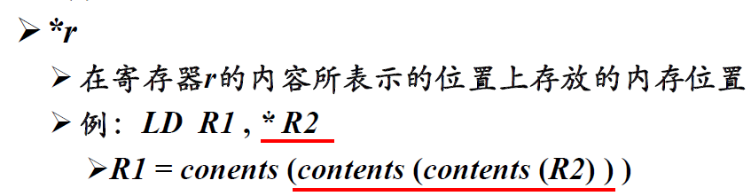
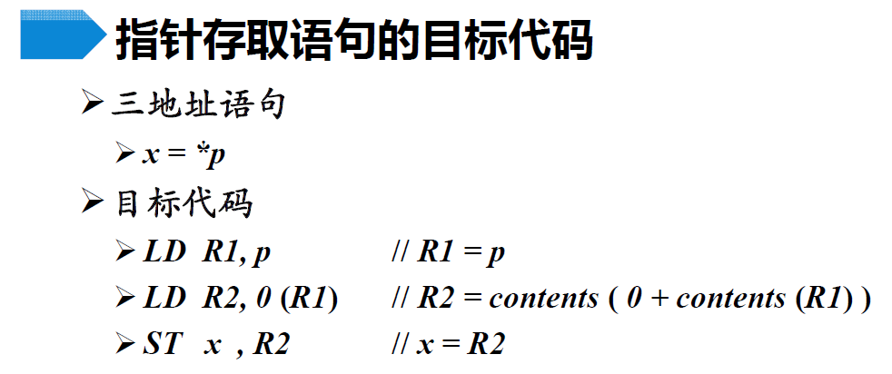
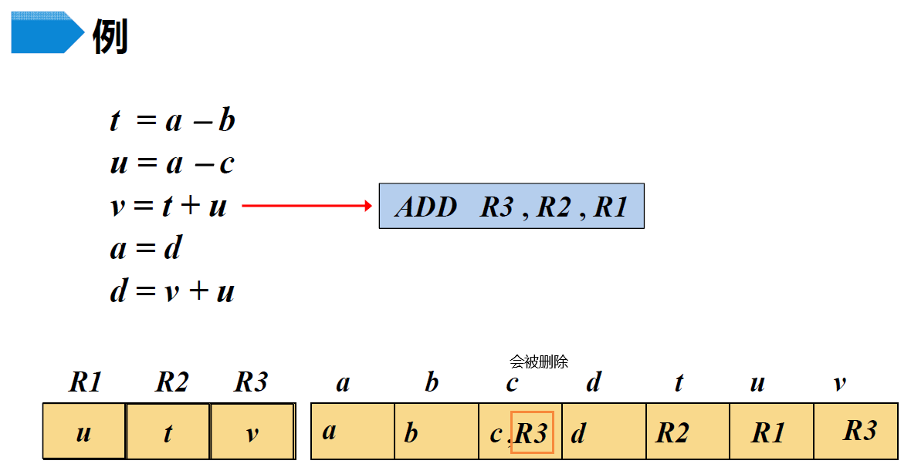

# 代码生成

## 代码生成器的主要任务

### 1 指令选择

举例1：

举例2：会生成**冗余的加载或保存指令**，需要进一步优化

### 2 寄存器分配和指派

### 3 指令排序

## 目标机模型

> 优秀的代码生成器需要熟悉**目标计算机及其指令系统**

### 1 概述

### 2 主要指令

> LTZ：Less Than Zero

### 3 寻址模式

变量名表示地址：

a(r)形式：

c(r)形式：

间接寻址模式1：

> 注意这里的*r不是高级语言中的一级指针，而是目标代码中的一种定义，和一级指针不是一个意思，r中的内容不是**目标数**的地址，而是**存放目标数地址**的地址（二级指针）
>
> > 这个地方可能还有问题，需要注意

间接寻址模式2：

立即数（这个其实不是寻址）：

## 指令选择

> 为中间表示语句选择合适的目的指令序列

### 1 运算语句

上面列出的是一定能完全任务的完整4条指令，但在特定情况下指令选择可以做得更好一些

### 2 数组寻址语句

### 3 指针存取语句

> 注意这里的*修饰的是三地址，而不是目标代码，所以这样翻译是没问题的

### 4 条件跳转语句

> 黄框里说的意思是，一条三地址指令可以翻译出多条目标代码，这里是跳到其中的第一条

### 5 过程调用和返回

静态存储分配：

> 注意，ST语句的第一个参数是**地址**，也就是目标数要存放在这个地址上，需要取目标数的时候，要对这个地址进行解引用
>
> > 这个地方可能还有问题，需要注意。这讲得真烂

栈式存储分配：

> 这就需要借助SP了，SP代表的是运行状态下的地址。之前说过SP是指向局部数据的基址，我不知道这里是不是有个相等的关系，这样直接加上`caller.recordsize`之后，可以直接指向被调用过程局部数据的基址（好像不太对，这俩sp可能不一样）

## 指令的开销

### 1 约定的目标机模型

### 2 寻址模式与寻址开销

这里的开销主要指的是**存储开销**（就是存这条指令+还需要存的东西），而不是**访存开销**

- 认为上图中的M、c需要存储，R不需要存储

  > 存一个地址是需要额外开销的，寄存器是不需要的，直接指派就很容易

## 寄存器的选择

### 1 任务

还需要记录变量的值存放在哪些寄存器中，内存中变量的值是否为正确值（因为可能刚计算完保存在寄存器中）

> 这个getReg函数下一节会讲，挺重要的

### 2 描述符

- 寄存器描述符中只可能出现变量名，在“复制”语句执行后可能出现多个变量名
- 地址描述符中可以出现变量名自己（代表内存单元）、寄存器名，甚至可以不出现变量名（意思就是还没写回内存）

### 3 管理描述符

> 下面的操作有些是”加入“，有些是”只包含“，可以结合具体的例子理解原因

> 不懂第二条操作是为什么

> ？？？？？？？？？？？？？？（通过后面的例子或许能更好地理解一下）
>
> 假设`getReg`函数会为x和y选择同一个寄存器
>
> > 这个`getReg`函数下一节会讲

### 4 举例

- 假设tuv是基本块的局部临时变量

  > 临时变量只会存放在寄存器中

- 假设abcd在基本块出口处活跃

- 这里说因为b之后不会被用到了，所以直接把结果存的R2中

  > 不懂怎么在编译阶段得出”b不会再用到的“结论

- 这里直接存到R1中，应该也是知道a之后不会再用到（这里说的用到指的是出现在等号右侧）

- 注意这里a的地址描述符里没有a了，因为a被改了，内存中的不再是a的有效值

收尾工作：

### 5 getReg的设计

给源操作数选择寄存器的策略：

> 这里的关键是，从内存中取出来之后，数放哪

> 保存指令就是需要把一些数保存到内存中

计算费用：

- $v_i$是x代表$v_i$马上要被更新了，可以考虑直接覆盖掉，但在此之前还要看看在这次更新中是不是要用到$v_i$，如果用不到，那这个值就真没用了，直接覆盖

- 如果上面说的那条链有一处不满足，也就是不能确定可以覆盖，就要看这个变量之后有没有用了

  > 不太懂为什么$v_i$在当前指令中要用到，还可以覆盖

给目标操作数选择寄存器的策略：

> 这里的关键是，数算出来之后，放哪

> 选择$R_y$的方法就是给源操作数选寄存器的方法

## 窥孔优化

