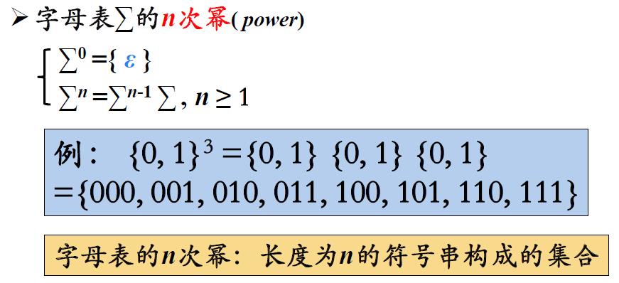

# 语言及其文法

## 基本概念

### 1 字母表及其运算

#### 1.1 字母表的概念

#### 1.2 乘积

#### 1.3 幂运算

#### 1.4 正闭包

#### 1.5 克林闭包

### 2 串及其运算

#### 2.1 串的概念

#### 2.2 连接和前后缀

#### 2.3 幂

## 文法的定义

> 

### 1 文法的形式化定义

#### 1.1 终结符

#### 1.2 非终结符

> 

#### 1.4 产生式

> 

#### 1.5 开始符号

> 

### 2 产生式的简写

> 

### 3 符号约定

终结符：

非终结符：

文法符号：

> 

## 语言的定义

> 

### 1 推导和归约

#### 1.1 推导

> 

#### 1.2 归约

> 回答前面的问题：
>
> 

### 2 句型和句子

> 

### 3 语言的形式化定义

> 文法解决了无穷语言的有穷表示问题

> 语言举例：
>
> 

### 4 语言上的运算

> 

## 文法的分类

### 0型文法

### 1型文法

> 
>
> 都要求$\alpha$中至少包含一个非终结符

### 2型文法

> 

### 3型文法

> 
>
> 用两种文法生成的标识符，当然还可以写一个左线性文法

### 四种文法之间的关系

