# 绪论

## 1 什么是编译

### 1.1 计算机程序设计语言及编译

> **编译的本质就是一个翻译的过程**

### 1.2 编译器在语言处理系统中的位置

- 大型程序通常都是**分成多个部分编译**的，所以**可重定位的机器代码**要链接**其他可重定位的目标程序**和**库文件**，然后才能生成**可执行代码**
- **外部内存地址**：一个文件中的代码可能会引用**另一个文件中的数据对象和过程**，这些数据对象和过程的地址相对于本文件来说就是外部内存地址

## 2 编译系统的结构

### 2.1 人工英汉翻译的例子

- 分析英语，得到语义，再用汉语说一遍

- 怎么进行**语义分析**？

  - 从**划分句子成分**入手，抓住**核心谓语动词**
  - 分析**核心谓语动词的上下文**，补充语义
    - 从中心节点引出若干条边，连接到周围的节点
    - 边上的信息表示这些实体同核心谓语动词的**关系**

- 根据什么划分句子成分？**语法分析**

  - **识别出句子中的各类短语**

    

- 根据什么识别出句子中的各类短语？词法分析

  - **词性**/词类

    

总结：

> 右边的图要从下往上看，形成一棵完整的树后，可以得到左边的图

### 2.2 编译器的结构

- 每个矩形也对应了一个**阶段**

- 多个阶段是有可能**组合在一起**执行的

  > 比如**语义分析**和**中间代码生成**可以组合到一起，因为语义分析的结果通常直接表示成中间代码的形式

- **语法分析**（分析句子结构）的同时也可以结合**语义规则**，直接进行**语义分析**，这一技术称为**语法制导翻译**；在这种情况下，**语法分析、语义分析和中间代码生成**可以组合到一起

## 3 词法分析概述

> 
>
> 词法分析是编译的第一个阶段

**<u>词法分析/扫描(Scanning)的主要任务</u>**：

> 同时要：查词法错误，进行标识符登记——符号表管理。

token的构成：

- 给定高级语言，**关键词、运算符、界限符**就确定了，可以一词一码，对于运算符，可以一型一码，同一类型下使用属性值区分
- 标识符不能提前枚举，所以都看作一类，多词一码，通过**属性值**来区分不同的标识符，也就是其**字面值**
- **常量**不能提前枚举，但不同类型的常量构成方式不同，可以一型一码

- 一词一码的单词，第二个分量通常都是空的
- 多词一码和一型一码的单词，第二个分量通常都是其**字面值**

> 词法分析器如何将输入的字符序列转换成token序列呢？后面会详细讲解

## 4 语法分析概述

> 
>
> 语法分析是编译的第二个阶段

> 

- 标识符和常量本身就可以构成一个表达式
- 表达式之间可以通过运算符构成一个更大的表达式
- 表达式与标识符可以通过赋值运算符和分号构成一个赋值语句

> 语法分析器如何根据语法规则为输入的句子构造分析树？后面会详细讲解

## 5 语义分析概述

> 
>
> 语义分析是编译的第三个阶段

语义分析(semantic analysis)一般和语法分析同时进行，称为语法制导翻译(syntax-directed translation)

功能：分析由语法分析器识别出来的语法成分的语义

- 获取标识符的属性：类型、作用域等
- 语义检查：运算的合法性、取值范围等
- 子程序的静态绑定：代码的相对地址
- 变量的静态绑定：数据的相对地址

> 高级语言程序中的语句大体分为两类，一类是**声明语句**，一类是**可执行语句**
>
> 声明语句会声明对象或过程，并为他们起一个名字，就是标识符

<u>对于声明语句来说，语义分析的主要任务：**收集标识符的属性信息**</u>

- 种属(Kind)

  - 简单变量、复合变量（数组、记录、…）、过程、…

- 类型(Type)

  - 整型、实型、字符型、布尔型、指针型、…

- 存储位置、长度

  

- （变量的）值

  > 这里的值应该指的是**变量名**

- （过程的）作用域

- （对于过程的名字来说）参数和返回值信息

  - 参数个数、参数类型、参数传递方式、返回值类型、…

- 每一个标识符都对应符号表的一条记录，记录的每一个字段对应着标识符的属性

- 字符串表用来放程序中用到的标识符和？？常数

  > ？？是我没听清老师说的这两个字

- NAME字段被分成两部分，第一部分是标识符的起始位置，第二部分是标识符的长度

> 
>
> 这是课后思考，目前没找到标准答案

**<u>语义检查</u>**：

> 下面列出常见的语义错误

- 变量或过程**未经声明就使用**

- 变量或过程名**重复声明**

- **运算分量**类型不匹配

  > 这时可能发生**自动类型转换**

- **操作符**与**操作数**之间的类型不匹配

  - **数组下标**不是整数
  - 对**非数组变量**使用数组访问操作符
  - 对**非过程名**使用过程调用操作符
  - 过程调用的**参数类型或数目**不匹配
  - 函数**返回类型**有误

## 6 中间代码生成及编译

> 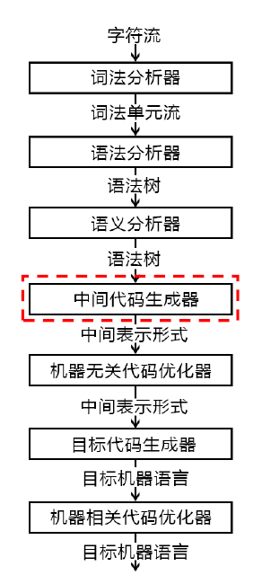

中间代码的特点：

- 简单规范
- 与机器无关
- 易于优化与转换

### 6.1 常用的中间表示形式

<u>三地址码(Three-address Code)</u>：

- 三地址码由**类似于汇编语言**的指令序列组成
- 每个指令**最多有三个操作数**(operand)

语法结构树/语法树(Syntax Trees)：

- 和语法分析树不是一回事，之后会讲

### 6.2 常用三地址指令

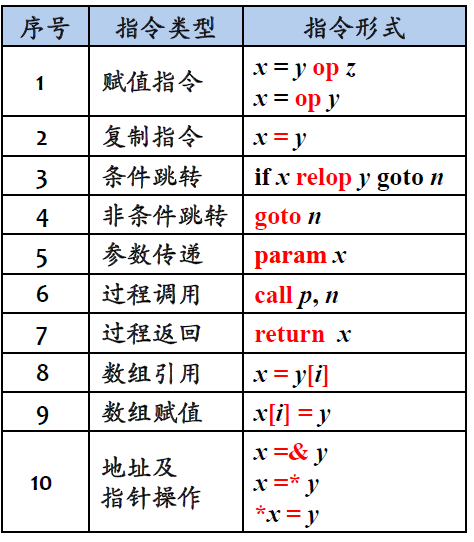

> 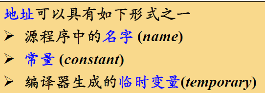
>
> 通过符号表即可查询到物理地址

### 6.3 三地址指令的表示

**<u>四元式(Quadruples)</u>**：(op, y, z, x)

- 一个操作符
- 两个源操作数
- 一个目标操作数

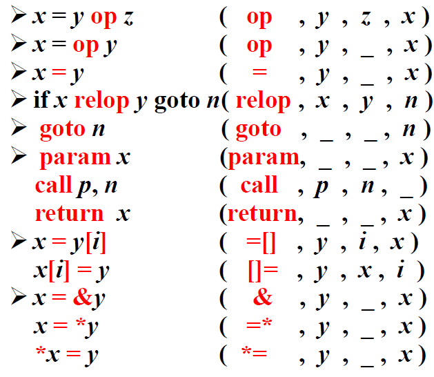

> i往往代表**偏移地址**，它前面的y或者x往往代表基地址

> 四元式表示与自然语言有一定的相似性

> 三地址指令序列唯一确定了运算完成的顺序

> 中间代码生成的例子：
>
> 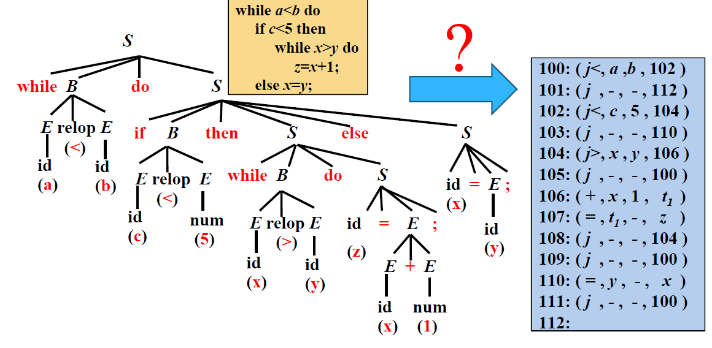
>
> 如何根据语法分析树生成中间代码？之后会介绍

### 6.4 目标代码生成与优化

目标代码的生成：

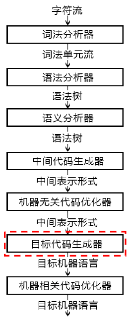

- 目标代码生成以源程序的**中间表示形式**作为输入，并把它映射到**目标语言**，即目标机上的机器指令代码或汇编代码
- 制定从中间代码到目标代码的翻译策略或算法
- 目标代码生成的一个重要任务是为程序中使用的变量合理**分配寄存器**

> 目标代码的形式
>
> - 具有绝对地址的机器指令
> - 汇编语言形式的目标程序
> - 模块结构的机器指令（需要链接程序）

代码优化：

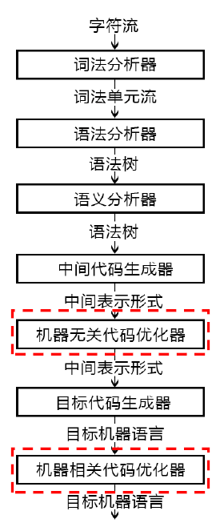

- 为改进代码所进行的**等价程序变换**，使其**运行得更快**一些、**占用空间更少**一些，或者二者兼顾
- 机器无关优化
  - 局部优化
    - 常量合并：常数运算在编译期间完成，如8+9*4
    - 公共子表达式的提取：在基本块内进行的
  - 循环优化
    - 强度削减，用较快的操作代替较慢的操作: X^2^→X*X
    - 代码外提，将循环不变计算移出循环
- 机器有关优化
  - 寄存器的利用
    - 将常用量放入寄存器，以减少访问内存的次数
  - 体系结构
    - MIMD、SIMD、SPMD、向量机、流水机
  - 存储策略
    - 根据算法访存的要求安排：Cache、并行存储体系——减少访问冲突
  - 任务划分
    - 按运行的算法及体系结构，划分子任务(MPMD)

## 7 表格管理与错误处理

### 7.1 表格管理

管理各种符号表(常数、标号、变量、过程、结构……)，查、填（登记、查找）源程序中出现的符号和编译程序生成的符号，为编译的各个阶段提供信息。

- 辅助语法检查、语义检查
- 完成静态绑定、管理编译过程

Hash表、链表等各种表的查、填技术

“数据结构与算法”课程的应用

### 7.2 错误处理

进行各种错误的检查、报告、纠正，以及相应的续编译处理(如：错误的定位与局部化)

- 词法：拼写……、
- 语法：语句结构、表达式结构……
- 语义：类型不匹配、参数不匹配……

## 8 编译程序的组织与生成

### 8.1 编译程序的组织

遍（Pass）：

- 根据系统资源的状况、运行目标的要求……等，可以将一个编译程序设计成**多遍（Pass）扫描**的形式，在每一遍扫描中，完成不同的任务。

  - 如：首遍构造语法树

  ​     二遍处理中间表示、增加信息等。

- 遍可以和阶段相对应，也可以和阶段无关

- 单遍代码不太有效

编译程序的设计目标：

- 规模小、速度快、诊断能力强、可靠性高、可移植性好、可扩充性好
- 目标程序也要规模小、执行速度快

前端与后端：

> 编译系统规模较大，因此可移植性很重要；
>
> 为了提高可移植性，将编译程序划分为前端和后端

- 前端
  - 与源语言有关、与目标机无关的部分
  - 词法分析、语法分析、语义分析与中间代码生成、与机器无关的代码优化
- 后端
  - 与目标机有关的部分
  - 与机器有关的代码优化、目标代码生成

### 8.2 编译程序的生成

> 可以用任何一种语言写一个编译程序，但问题的关键在于，如何让这个编译程序运行起来，也就是如何**把这个编译程序搞成机器语言的版本**

T形图：

> 实现语言指的是编译程序用什么语言写的

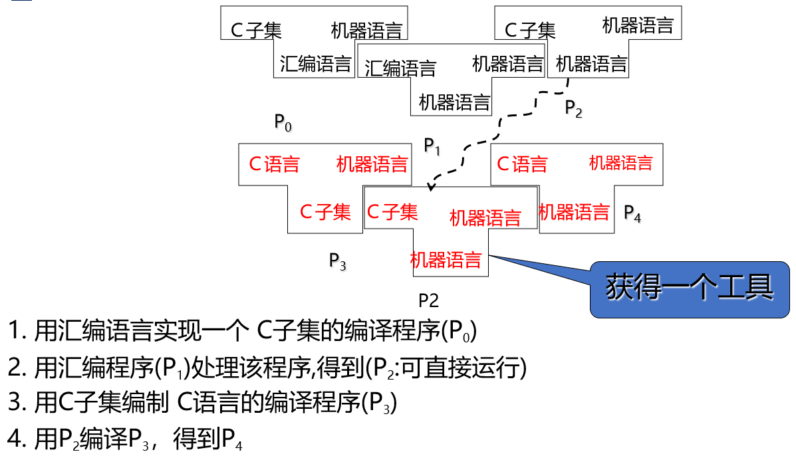

> $P_0$和$P_2$是由人编写的

语言的**<u>移植</u>**编译问题：

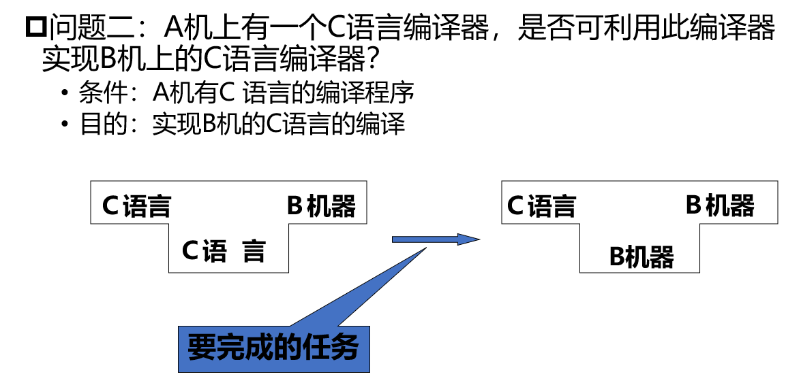

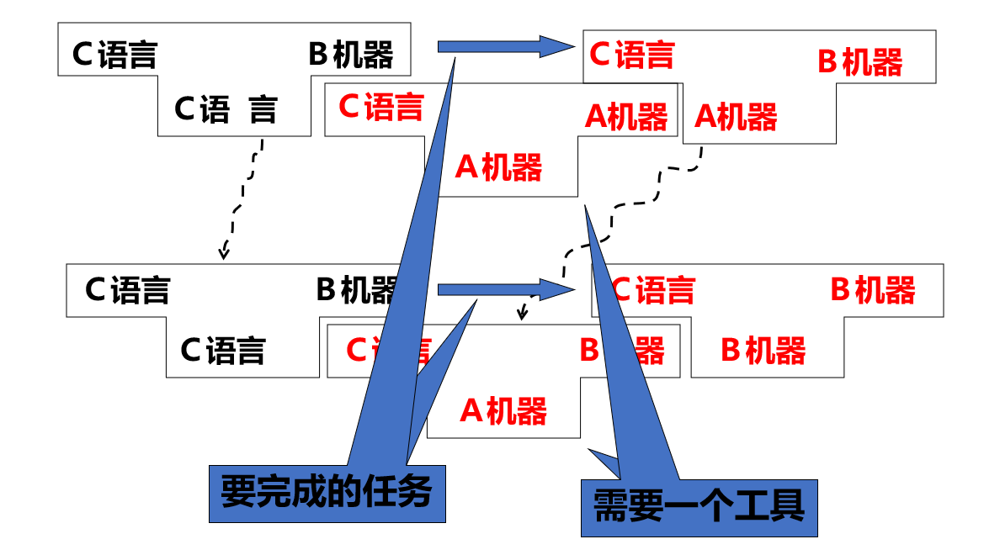

**<u>新语言</u>**的编译问题：

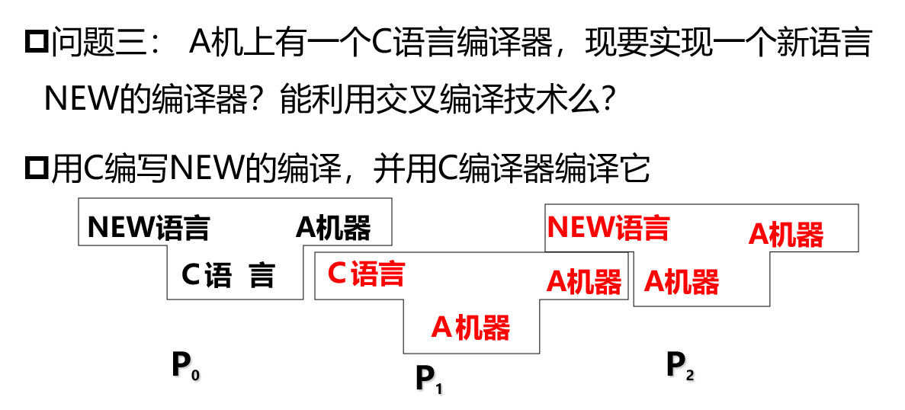
