# 绪论

## 1 什么是编译

### 1.1 计算机程序设计语言及编译

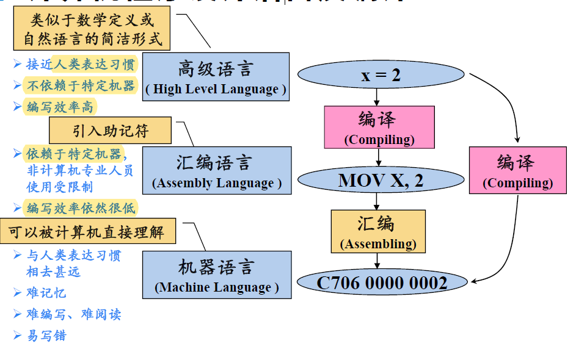

> **编译的本质就是一个翻译的过程**

### 1.2 编译器在语言处理系统中的位置

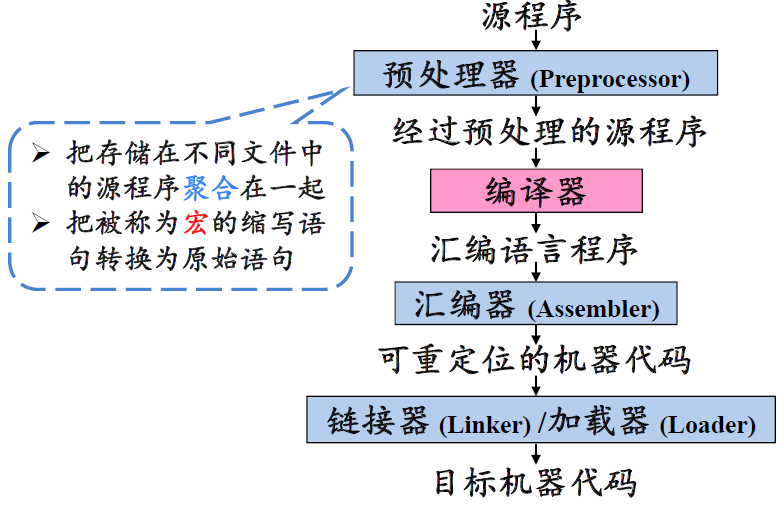

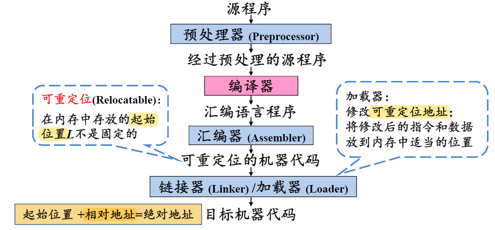

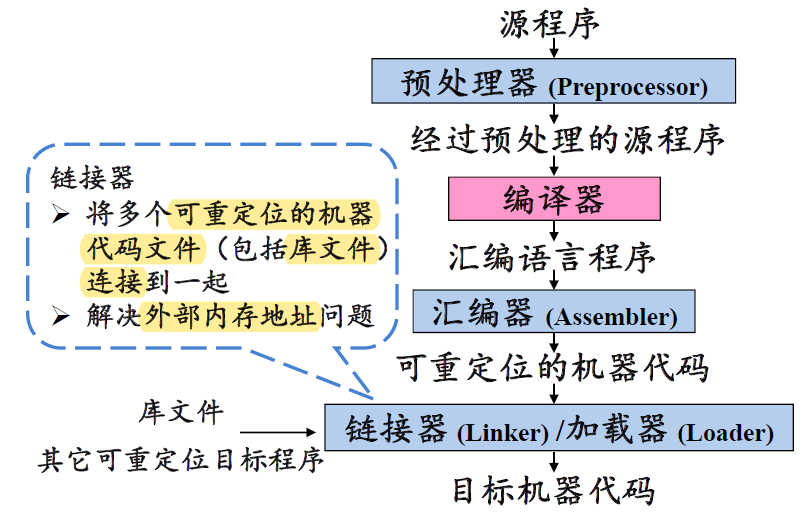

- 大型程序通常都是**分成多个部分编译**的，所以**可重定位的机器代码**要链接**其他可重定位的目标程序**和**库文件**，然后才能生成**可执行代码**
- **外部内存地址**：一个文件中的代码可能会引用**另一个文件中的数据对象和过程**，这些数据对象和过程的地址相对于本文件来说就是外部内存地址

## 2 编译系统的结构

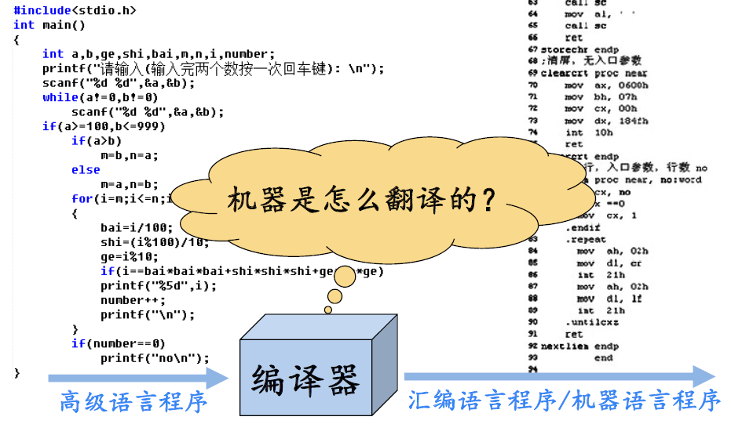

### 2.1 人工英汉翻译的例子

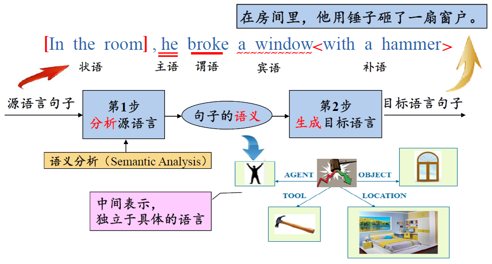

- 分析英语，得到语义，再用汉语说一遍

- 怎么进行**语义分析**？

  - 从**划分句子成分**入手，抓住**核心谓语动词**
  - 分析**核心谓语动词的上下文**，补充语义
    - 从中心节点引出若干条边，连接到周围的节点
    - 边上的信息表示这些实体同核心谓语动词的**关系**

- 根据什么划分句子成分？**语法分析**

  - **识别出句子中的各类短语**

    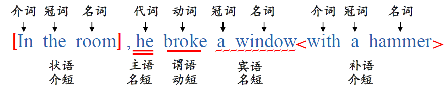

- 根据什么识别出句子中的各类短语？词法分析

  - **词性**/词类

    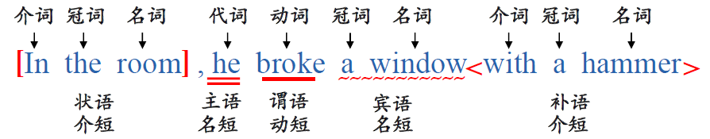

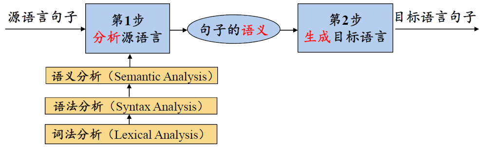

总结：

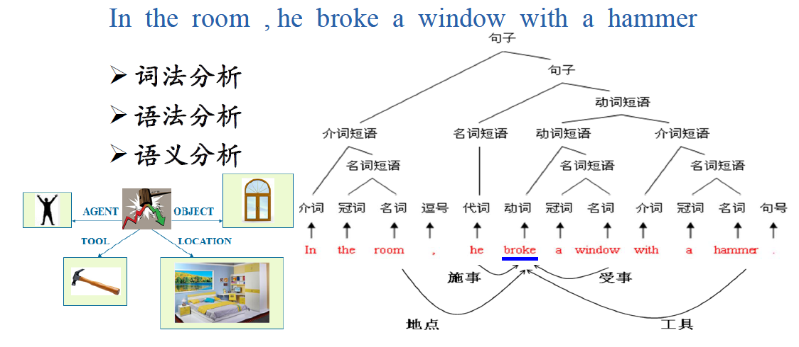

> 右边的图要从下往上看，形成一棵完整的树后，可以得到左边的图

### 2.2 编译器的结构

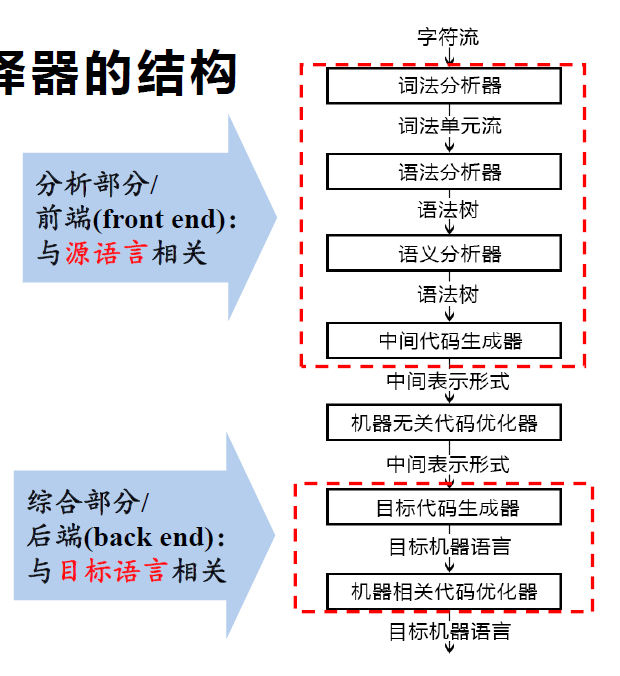

- 每个矩形也对应了一个**阶段**

- 多个阶段是有可能**组合在一起**执行的

  > 比如**语义分析**和**中间代码生成**可以组合到一起，因为语义分析的结果通常直接表示成中间代码的形式

- **语法分析**（分析句子结构）的同时也可以结合**语义规则**，直接进行**语义分析**，这一技术称为语法制导翻译；在这种情况下，语法分析、语义分析和中间代码生成可以组合到一起

## 3 词法分析概述

> 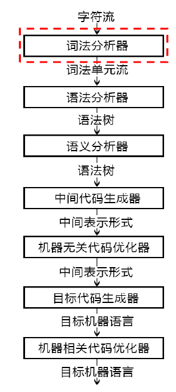
>
> 词法分析是编译的第一个阶段

**<u>词法分析/扫描(Scanning)的主要任务</u>**：

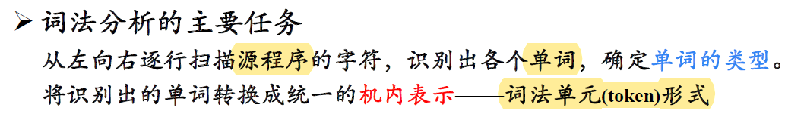

token的构成：

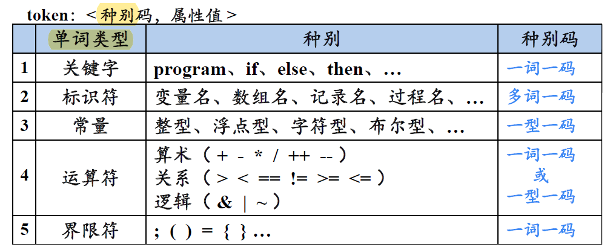

- 给定高级语言，**关键词、运算符、界限符**就确定了，可以一词一码，对于运算符，可以一型一码，同一类型下使用属性值区分
- 标识符不能提前枚举，所以都看作一类，多词一码，通过**属性值**来区分不同的标识符，也就是其**字面值**
- **常量**不能提前枚举，但不同类型的常量构成方式不同，可以一型一码

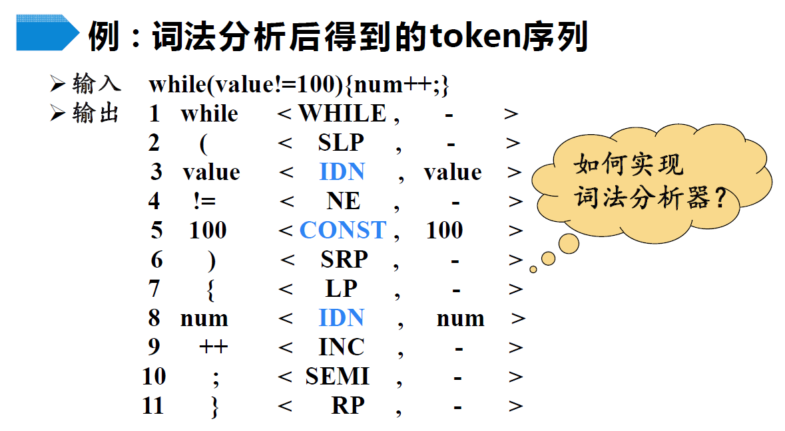

- 一词一码的单词，第二个分量通常都是空的
- 多词一码和一型一码的单词，第二个分量通常都是其**字面值**

> 词法分析器如何将输入的字符序列转换成token序列呢？后面会详细讲解

## 4 语法分析概述

> 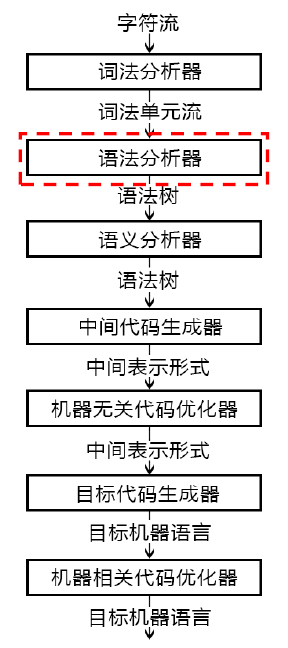
>
> 语法分析是编译的第二个阶段

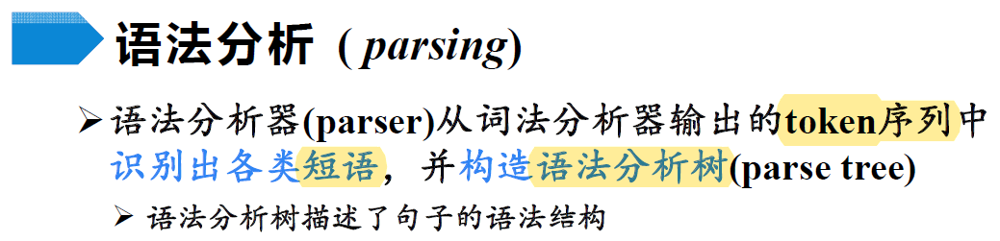

> 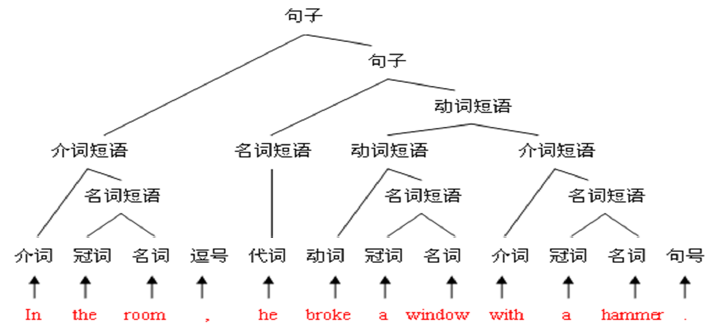

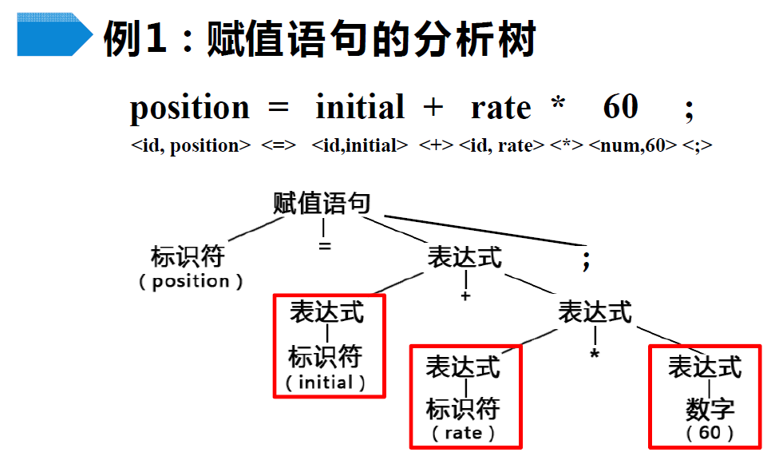

- 标识符和常量本身就可以构成一个表达式
- 表达式之间可以通过运算符构成一个更大的表达式
- 表达式与标识符可以通过赋值运算符和分号构成一个赋值语句

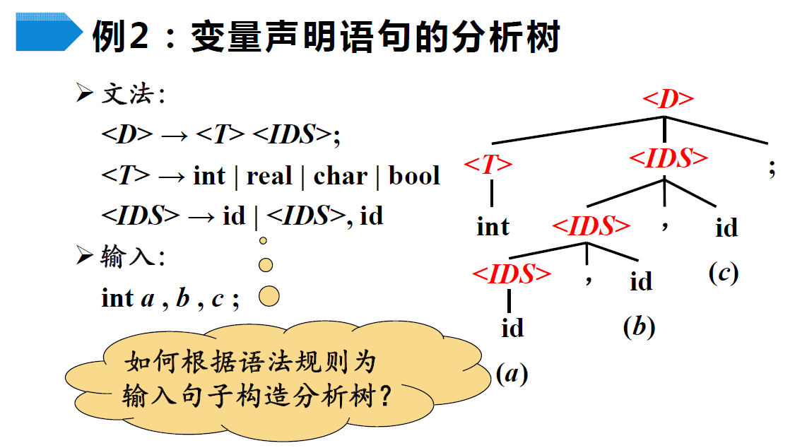

> 语法分析器如何根据语法规则为输入的句子构造分析树？后面会详细讲解

## 5 语义分析概述

> 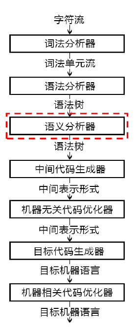
>
> 语义分析是编译的第三个阶段

> 高级语言程序中的语句大体分为两类，一类是**声明语句**，一类是**可执行语句**
>
> 声明语句会声明对象或过程，并为他们起一个名字，就是标识符

<u>对于声明语句来说，语义分析的主要任务：**收集标识符的属性信息**</u>

- 种属(Kind)

  - 简单变量、复合变量（数组、记录、…）、过程、…

- 类型(Type)

  - 整型、实型、字符型、布尔型、指针型、…

- 存储位置、长度

  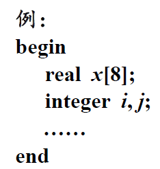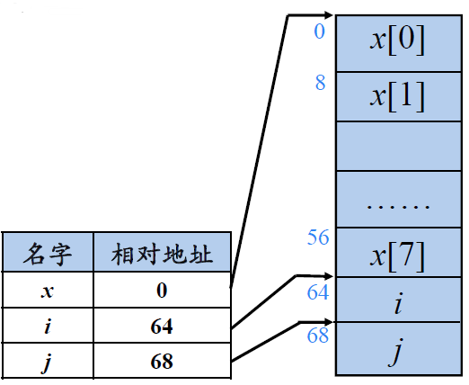

- （变量的）值

  > 这里的值应该指的是**变量名**

- （过程的）作用域

- （对于过程的名字来说）参数和返回值信息

  - 参数个数、参数类型、参数传递方式、返回值类型、…

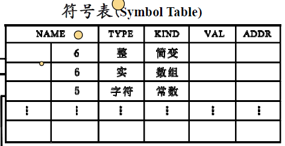

- 每一个标识符都对应符号表的一条记录，记录的每一个字段对应着标识符的属性

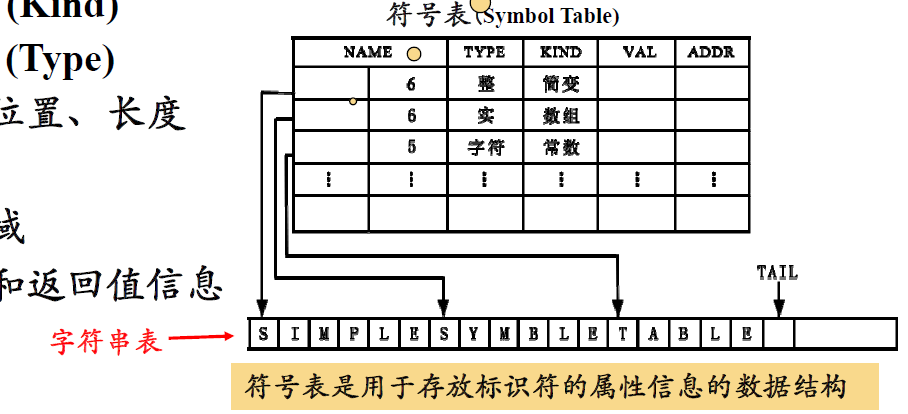

- 字符串表用来放程序中用到的标识符和？？常数

  > ？？是我没听清老师说的这两个字

- NAME字段被分成两部分，第一部分是标识符的起始位置，第二部分是标识符的长度

> 
>
> 这是课后思考，目前没找到标准答案

**<u>语义检查</u>**：

> 下面列出常见的语义错误

- 变量或过程**未经声明就使用**

- 变量或过程名**重复声明**

- **运算分量**类型不匹配

  > 这时可能发生**自动类型转换**

- **操作符**与**操作数**之间的类型不匹配

  - **数组下标**不是整数
  - 对**非数组变量**使用数组访问操作符
  - 对**非过程名**使用过程调用操作符
  - 过程调用的**参数类型或数目**不匹配
  - 函数**返回类型**有误

## 6 中间代码生成及编译

