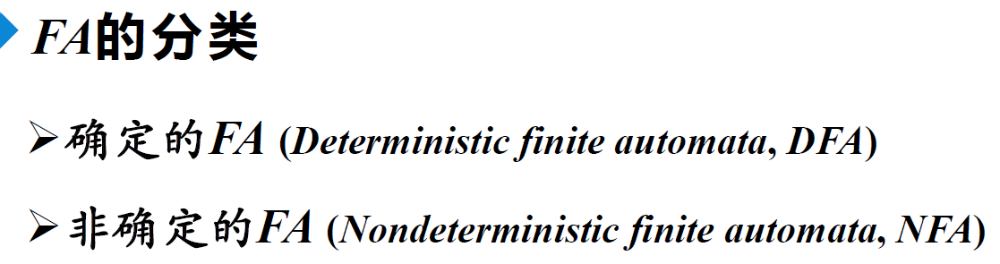
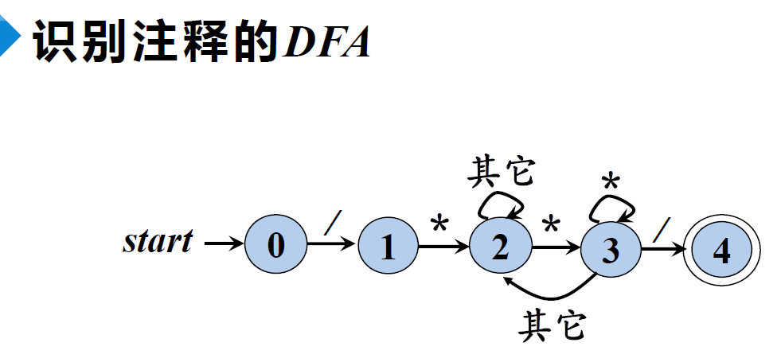
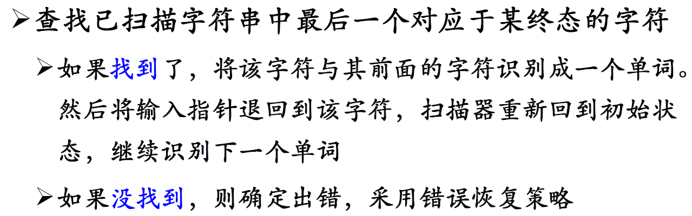

# 词法分析

## 正则表达式

引例：

---

### 1 定义

> 应用举例：
>
> 
>
> 

### 2 正则语言

### 3 RE的代数定律

### 4 正则表达式与正则文法

## 正则定义

> 给一些 RE 命名 ，并在之后的 RE 中像使用 字母表中的符号一样使用这些名字

> 举例：
>
> 
>
> 

## 有穷自动机

### 1 有穷自动机简介

> 举例：
>
> 

### 2 FA模型与转换图

### 3 FA定义（接收）的语言

> 

### 4 最长子串匹配原则

## DFA与NFA

### 1 DFA

> 

### 2 NFA

> 

### 3 DFA与NFA的等价性

> 

### 4 $\epsilon$-NFA

> 

### 5 DFA算法的实现

> 从计算机实现的角度讲，DFA比NFA更容易实现

## 从RE到DFA

总体的思路：RE$\rarr$NFA$\rarr$DFA

### 1 RE$\rarr$NFA

> 总体思路：==分解、递归==

递归基础：

> 举例：分解（递归）
>
> 

### 2 NFA$\rarr$DFA

> 总体思路：==转换表==

下面这个例子是带有$\epsilon$的，在输入字符的前后都可以添加若干个$\epsilon$以跳转到所有可能的状态，其实就是$\epsilon$-闭包

> 所以初始状态直接是{A,B,C}

---

相关算法：子集构造法

> 因为NFA中的每个状态是其要转换成的DFA的某个状态的子集

> 算法中的空闭包函数：
>
> 

## 识别单词的DFA

### 1 识别标识符的DFA

### 2 识别无符号数的DFA

### 3 识别各进制无符号整数的DFA

### 4 识别注释的DFA

### 3 识别各类单词的DFA

## 词法分析阶段的错误处理

### 1 错误类型与检测

> 这里可能有点问题，就算是终止状态也应该报错	

### 2 错误处理程序

### 3 错误恢复

> :star:错误处理这里有些不明白，需要进一步补充理解