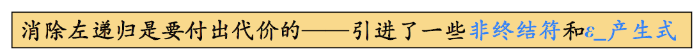
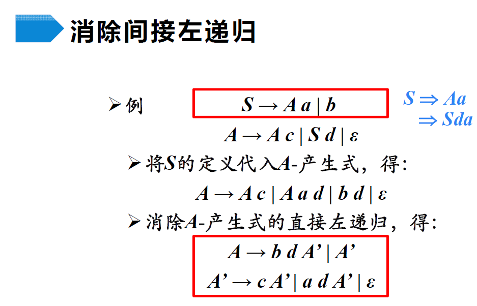
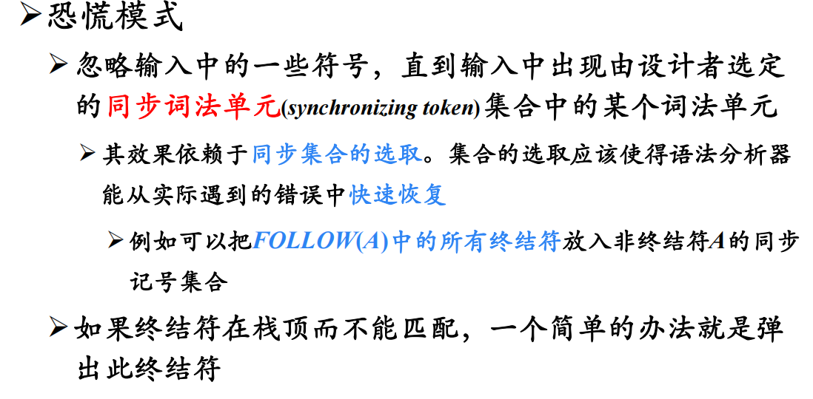
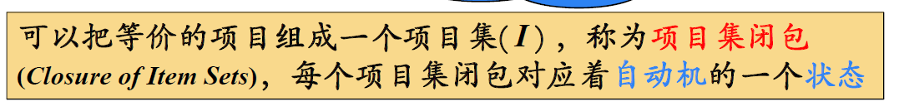
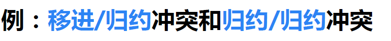

# 语法分析

## 自顶向下分析

### 1 概述

- 怎么选择？下面就会讲几种选择方式

> 举例：
>
> 

#### 1.1 最左推导与最右推导

> 最左推导和最右推导具有唯一性

> 举例：
>
> 
>
> 按照上述规则分析，可以成功分析且分析结束后叶节点自左向右刚好构造输入串

#### 1.2 计算机实现自顶向下分析

需要回溯的分析器称为不确定的分析器，如果能预测出正确的产生式就是预测分析

#### 1.3 预测分析简介

### 2 文法转换

> 并不是所有文法都直接适用于自顶向下的分析，文法转换就是要改造这些文法以使其适合自顶向下的分析

#### 2.1 回溯问题与左递归

#### 2.2 消除直接左递归

> 举例：
>
> 

- 根据是否会导致左递归，把产生式分为两类，对这两类分别进行处理即可

> 

#### 2.3 消除间接左递归

- 只是多了一个代入的步骤

#### 2.4 消除左递归算法

> 循环推导就是A推着推着又回到A了

#### 2.5 提取左公因子

> 本质是在**推迟决定**

#### 2.6 提取左公因子算法

## 预测分析

### 1 LL(1)文法

> 什么样的文法才能使用预测分析呢？才能不用回溯呢？

> 根据自己想要的目标，设想出一个一定能满足目标的最方便的文法，但这个文法限制太多了，可以在同样满足目标的前提下，尝试一点一点放宽这个限制，提出新的文法

#### 1.1 S_文法

> 由此观之，候选式指的是**右部**

> 

#### 1.2 空产生式的使用

- 什么是A的后面？从分析树的角度看，就是当前分析树的**右紧邻兄弟节点**，看这个节点能不能推出输入符（或者这个节点直接就是输入符了）

#### 1.3 非终结符的后继符号集

> 

#### 1.4 产生式的可选集

#### 1.5 q_文法

> 这里说成“相同左部”，其实和S_文法那里说的“同一非终结符”是一样的约束前提

#### 1.6 串首终结符集

> 什么时候能用$A\rarr\alpha$来推导？用了它之后能在最左边产生输入符，也就是输入符在$\alpha$的串首终结符集中

#### 1.7 LL(1)文法

> 所谓任意两个，就是对所有相同左部产生式的约束；总之就是让能推导出的所有句型的首终结符都不相同；下面那两条的意思就是**可选集互不相交**，只不过当出现了推导出空的情况时，可以将“可选集互不相交”化简成这个样子

> 

### 2 FIRST集、FOLLOW集、SELECT集的计算

#### 2.1 文法符号的FIRST集

FIRST集的定义：

> 举例：
>
> 

算法：

#### 2.2 符号串的FIRST集

算法：

#### 2.3 非终结符的FOLLOW集

定义：

> 举例：
>
> 
>
> 从中可以看出，一个非终结符的FOLLOW集可能依赖于另一个非终结符的FOLLOW集，所以要进行多轮计算，直到某一轮计算中，FOLLOW集不再更新

算法：

#### 2.4 由FIRST集和FOLLOW集计算SELECT集

- 同一非终结符各个**产生式**的**可选集**互不相交

LL(1)文法可以构造预测分析表：

### 3 递归的预测分析算法

举例：

### 4 递归的预测分析算法

> 下推自动机相当于给有穷自动机增加了记忆功能。图中的例子L，有穷自动机是无法识别的，因为n没有限制，可以”无穷“个，这是矛盾的

举例：

> 初始时栈底为语言结束符，栈顶为文法开始符号

- 对比输入指针符号与栈顶符号
  - 若栈顶符号为终结符
    - 二者相等，弹栈，输入指针后移
    - 二者不相等，报错
  - 若栈顶符号为非终结符，则根据SELECT集选择产生式，根据产生式弹栈并入栈

> 

### 5 错误处理

#### 5.1 错误检测

#### 5.2 错误恢复

> 意思就是，出错的时候，可以直接把输入符号扔掉，直到不出错，但这样扔有点太笨了，如果这个输入符在当前非终结符的后继符号集中，可以考虑把当前非终结符扔掉，这样也可以继续往下识别

举例：

- 同步词法单元的设置：

  

- 

- 分析表如何工作：

  

### 6 总结

## 自底向上分析

### 1 概述

#### 1.1 移入-归约分析简介

> 举例：
>
> 
>
> 句柄形成后立即归约，所以每一步归约都是**最左归约**；
>
> 根据之前学过的知识知道，每次使用产生式进行**最右推导**，得到的符号串都是一个句型，称之为“**最右句型**”或“**规范句型**”，所以反过来，最左归约在即将使用产生式之前也应该是一个**规范句型**，表现在上图中，就是蓝色区间的每一部分，**栈内符号和剩余输入**拼接成一个**规范句型**

#### 1.2 移入-归约分析的工作过程

#### 1.3 移入-归约分析中的关键问题

> 举例发现问题：
>
> 
>
> 
>
> 产生式的右部不一定是当前句型的直接短语，而每次其实是要选句型的**最左直接短语**来归约的，所以不能看到某个产生式的右部出现了就直接用，而是在使用之前对比所有可用的产生式右部，看哪个是**最左直接短语**。
>
> > 比如上图中画红线的那一行，是即将归约前的一行，它是句型$var<IDS>,i_B:real$，这个句型的最左直接短语应该是$<IDS>,i_B$而不是$i_B$

给出句柄的严谨定义：**句型的最左直接短语**

> **<u>如何正确的识别句柄</u>**？这就是接下来要探讨的问题，也是**<u>自底向上分析的关键问题</u>**

### 2 LR分析法

#### 2.1 概述与基本原理

- 移进状态：圆点后面是终结符
- 待约状态：圆点后面是非终结符
- 归约状态：圆点后面没有符号

#### 2.2 结构与工作过程

> 注意左边有一个与符号栈平行的**状态栈**

LR分析表：

- 在有输入时，就要根据当前状态和**输入符号**使用$s_n$，注意是输入符号而不是栈顶符号

- 使用$r_n$进行归约时，也要跟着**弹出状态**，并且紧跟着规约之后，栈顶是非终结符，要进行一次***GOTO***状态转移，再根据新状态和**输入符号**进行***ACTION***

  > 这样的操作本质是为了**<u>保证符号栈和状态栈平行</u>**，平行之后才能ACTION

- 如果输入符号只剩结束符$\$$了，就一直把$\$$当成输入

> 分析表的应用举例：
>
> 
>
> 
>
> 
>
> 
>
> 
>
> 
>
> 
>
> 
>
> 
>
> 
>
> 
>
> 

工作过程总结：

LR分析算法：

> 有了分析表之后，LR分析算法十分简单
>
> 
>
> 接下来的重点就是**分析表**了！

### 3 LR(0)分析法

#### 3.1 概念

项目：项目描述了句柄识别的状态

增广文法：增广文法让分析器**只有一个接受状态**

> 举例：文法中的项目
>
> 
>
> 还有许多**移进项目**和**待约项目**没有标明

后继项目：

项目的等价性：

> 举例：
>
> 
>
> 一个**项目的$\cdot$后面紧跟着非终结符**时，就存在**等价项目**，可以理解成“在等待xxx，而xxx能推导出xxx，所以其实就是在等待xxx**最左边的符号**”，等价项目具有传递性，直到$\cdot$后面变成终结符或者空

#### 3.2 自动机与分析表构造思想

<u>LR(0)自动机构造举例</u>：

1. 用开始符号产生式的初始项目**项目集闭包**生成**初始状态**

2. 用初始状态中的每个项目结合它**“等待”的符号**得到每个**后继项目**，再用每个后继项目**项目集闭包**生成**状态**

   > 一个项目可以出现在多个状态中

3. 遍历每个状态中的每个项目，不断得到后继项目的项目集闭包并生成新状态，直到新状态中所有项目都是**归约项目**（已经存在的状态之间是可能互相转换的）

<u>通过状态机构造分析表举例</u>：

- 边上是非终结符的，对应GOTO表；边上是终结符的，对应ACTION表

- 一行一行填表

- **接收项目**是单独在一个状态里，对应**接收状态**，在表中与结束符$\$$形成表项$acc$

- **待约**状态对应的表项都是$s_n$，**归约**状态对应的表项都是$r_n$，而且能归约的时候不管遇到什么输入都会执行归约的ACTION

  

#### 3.4 自动机与分析表构造算法

<u>项目集闭包</u>：

<u>后继项目集闭包</u>：

<u>构造LR(0)自动机的状态集</u>：

<u>LR(0)分析表构造算法</u>：

<u>LR(0)自动机的形式化定义</u>：

- LR(0)自动机的**冲突**问题：

  - 移进/归约冲突：

  

  

  - 归约/归约冲突：

    

    

如果LR(0)分析表中没有语法分析动作**冲突**，那么给定的文法就称为**<u>LR(0)文法</u>**

不是所有CFG都能用LR(0)方法进行分析，也就是说，**<u>CFG不总是LR(0)文法</u>**

> 如何解决冲突？SLR和LR(1)会给我们答案

### 4 SLR分析

> LR(0)分析为啥会有问题？因为没考虑**上下文环境**，没有向前查看符号
>
> 
>
> 如果能看看**FOLLOW集**，就会发现E后面不可能接*号，所以把T归约成E就是不对的。
>
> 这正是SLR分析的思想

#### 4.1 基本思想

- 所以其实要看的就是两种东西，对于移进/待约项目，看**圆点右侧的符号**；对于归约项目，看**左部FOLLOW集**

- 要保证**两两不相交**，这样选择就是唯一的；当然，如果不能保证两两不相交，那就还是有冲突，这种冲突会在下一小节解决

- 只向下查看一个符号就可以判断怎么做，也叫SLR(1)

  > S：Simple，只通过FOLLOW集化解冲突（之后会遇到需要更复杂方法才能化简的冲突）；
  >
  > LR(1)可简称为LR，所以叫SLR

> 举例1：
>
> LR(0)：
>
> 
>
> SLR：
>
> 
>
> - 在SLR分析表中，发现对于归约状态（含有归约项目的），并不全都是r了，而是只有在遇到FOLLOW集中元素时才归约

> 举例2：归约/归约冲突
>
> 

#### 4.2 SLR分析表构造算法

> 与LR(0)类似，不同之处在于对归约项目的处理，其他的都没变（CLOSURE、GOTO、项目集之类的算法还没变）
>
> LR(0)的分析表构造算法：
>
> 

- 变成了只对于左部FOLLOW集中的符号采取归约动作
- 如果给定文法的**SLR分析表**中不存在有冲突的动作，那么该文法称为**SLR文法**

#### 4.3 SLR中的冲突

怎么看的冲突？就是看那两部分，**圆点右**和**左部FOLLOW**

### 5 LR(1)分析

> SLR分析的问题：
>
> 
>
> 也就是说，**不在左部FOLLOW集中肯定不能用它归约**，但在左部FOLLOW集中不一定就非要用它归约

#### 5.1 基本思想

- 在特定的情况下，A后面能接的东西虽然都在FOLLOW集中，但都是子集，而且是有所不同的，这受到**A进一步会被规约成的符号**的影响，A**进一步会被规约成的符号**<u>右边能接的东</u>西，与A**的FOLLOW集**的交集，才是真正能规约的输入符号集

  > 这是因为每次都是最左规约，输入符号虽然现在在FOLLOW集中，但还可能被进一步规约，这个FOLLOW集就变了
  >
  > 目前留有的疑问：
  >
  > - A进一步会被规约成的符号：目前不确定是什么
  > - A进一步会被规约成的符号右边能接的东西：可能是FOLLOW集，也可能是所在右部的下一个符号

- 所以，SLR用FOLLOW集，显然是扩大了范围。重点是找到**特定位置的特定后继符**

<u>**规范LR(1)项目**</u>：

> 在构造项目时就已经考虑到了特定位置的特定后继符问题

- 注意重点，是当前状态能跟在A后面的，也就是当前状态能跟在**<u>产生式左部符号后面</u>**的

  > SLR中只有一个带圆点的产生式，根据FOLLOW集判断用不用它(归约项目)；现在直接根据输入符，把能用它的情况分成了多个项目，每个项目对应一个输入符，可以证明，展望符一定在左部FOLLOW集中，但左部FOLLOW集中的不都是展望符；当然有时候，产生式和圆点位置相同，但展望符不同的多个，也会写在一起成这样：$A\rarr\alpha\beta, a/b/c...$

  > LR(1)规范项目中，逗号左边的可称为第一分量，逗号右边的可称为第二分量

- LR(1) 中的1指的是项目的**第二个分量**的长度

  > 可以是k，但对于大多数语言，1就够了

- 

  > 就是说，对于移入项目和待约项目，展望符没用，但为了定义的完整，把它定义出来了

- 

  > 对于归约项目，展望符是有意义的

  - 这样的a的集合总是FOLLOW(A)的子集，而且它通常是一个真子集

<u>**等价LR(1)项目**</u>：（展望符怎么求）

- 首先得出项目的**等价项目**，然后看展望符，就分两种情况了，这要看等价项目左部在原项目中右边的符号(串)$\beta$

  - $\beta$能推出空，则直接继承

    > 因为此时可以跟在B后面的就是可以跟在A后面的

  - $\beta$不能推出空，则是其FIRST集，对于FIRST集中的每一个元素，都作为一次展望符，生成一个项目

- 从求解展望符的角度看，最初的项目就是初始项目，展望符为结束符$\$$

#### 5.2 LR(1)自动机与分析表

1. 初始项目$I_0$

   

   - 第二项和第三项由第一项等价出来，使用的是1)和2)产生式；由于第一项S后面没有符号，所以第二、三项继承其展望符
   - 第四项和第五项由第二项等价出来，L后面跟着终结符=，其FIRST集就是{=}，所以展望符是=
   - 第六项由第三项等价出来，由于第三项R后面没有符号，所以继承展望符
   - 其他同理，直到生成的都是移进项目，不再能推出等价项目

2. $GOTO(I_0, S)$

   

   - 只有归约项目，不能等价

3. $GOTO(I_0, L)$

   

   - 只有移进项目，不能等价

4. $GOTO(I_0,R)$

5. $GOTO(I_0,*)$

   

6. …同理，要注意的是，展望符不同，即使产生式和圆点位置相同，也是不同的项目

<u>**LR(1)分析表**</u>：

- 对于不涉及规约项目的状态，处理方法与LR(0)相同

- 对于涉及规约项目的状态，只有ACTION列(输入符号)是其**展望符**时才能规约

  > 之前构造SLR的时候，是遇到左部FOLLOW集中的符号都能规约

> 
>
> 可以看到，LR(1)对SLR的状态进行了分裂（当然LR(0)的自动机也长这样）
>
> 如果除展望符外，两个LR(1)项目集是相同的，则称这两个LR(1)项目集是**同心**的
>
> > 把同心的项目都合并了，就得到LR(0)项目集了，所以这里的”心“指的就是LR(0)

#### 5.3 自动机与分析表构造算法

> 因为展望符的加入而有所修改，主要修改的对象就是展望符相关的东西，和归约项目的处理

闭包的修改：

GOTO的修改：

项集族的修改：

LR(1)自动机定义的修改：

LR分析表构造算法的修改：

### 6 LALR分析法

> LR(1)分析确实解决了几乎所有冲突，但状态太多了，想让它少点，LALR就是这个目的，合并一些动作不冲突的状态
>
> 
>
> 直观上理解，画出的这些状态都可以参与合并

#### 6.1 基本思想

合并哪些项目？合并只保留第一分量时(重复的只留一个)，完全相同的项目集，这样的项目集也叫m同心项目集，也就是对应LR(0)项目集相同。这其实就是在合并**展望符集合**

> 合并后的展望符集合仍为FOLLOW集的子集

#### 6.2 自动机和状态表

> 

#### 6.3 合并同心项目集带来的问题

**<u>冲突问题</u>**：

- 按照之前的方法合并，就会出现这种**归约-归约冲突**，同一个输入符，不知道该用哪个产生式归约了，因为它们的**展望符**都相同

> 为啥不会造成移进-归约冲突？因为冲突的本质是展望符冲突，而移进时展望符没用
>
> > 合并之前已经没有移进-归约冲突了

**<u>推迟错误发现的问题</u>**：

- 合并同心项集后，虽然不产生冲突，但可能会**推迟错误的发现**

LALR分析法可能会作多余的**归约动作**，但绝不会作错误的**移进操作**

> LALR其实是在合并展望符集合，展望符与归约有关，与移进无关

#### 6.4 LALR的特点

形式上：

内容上：

分析能力上：

- 比LR(1)更晚发现错误
- 比SLR更细致地划分信息，延迟发现的错误其实是更少的

### 7 LR对二义性文法的分析与错误处理
