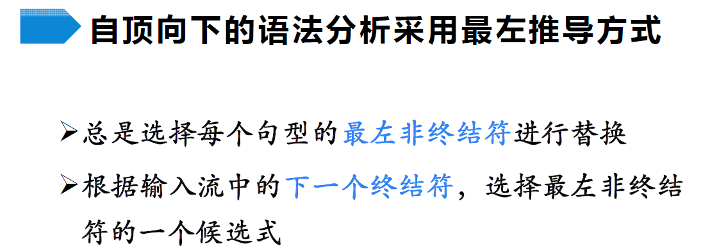

# 语法分析

## 自顶向下分析

### 1 概述

- 怎么选择？下面就会讲几种选择方式

> 举例：
>
> 

#### 1.1 最左推导与最右推导

> 最左推导和最右推导具有唯一性

> 举例：
>
> 
>
> 按照上述规则分析，可以成功分析且分析结束后叶节点自左向右刚好构造输入串

#### 1.2 计算机实现自顶向下分析

需要回溯的分析器称为不确定的分析器，如果能预测出正确的产生式就是预测分析

#### 1.3 预测分析简介

### 2 文法转换

> 并不是所有文法都直接适用于自顶向下的分析，文法转换就是要改造这些文法以使其适合自顶向下的分析

#### 2.1 回溯问题与左递归

#### 2.2 消除直接左递归

> 举例：
>
> 

- 根据是否会导致左递归，把产生式分为两类，对这两类分别进行处理即可

> 

#### 2.3 消除间接左递归

- 只是多了一个代入的步骤

#### 2.4 消除左递归算法

> 循环推导就是A推着推着又回到A了

#### 2.5 提取左公因子

> 本质是在**推迟决定**

#### 2.6 提取左公因子算法

## 预测分析

### 1 LL(1)文法

> 什么样的文法才能使用预测分析呢？才能不用回溯呢？

> 根据自己想要的目标，设想出一个一定能满足目标的最方便的文法，但这个文法限制太多了，可以在同样满足目标的前提下，尝试一点一点放宽这个限制，提出新的文法

#### 1.1 S_文法

> 由此观之，候选式指的是**右部**

> 

#### 1.2 空产生式的使用

- 什么是A的后面？从分析树的角度看，就是当前分析树的**右紧邻兄弟节点**，看这个节点能不能推出输入符（或者这个节点直接就是输入符了）

#### 1.3 非终结符的后继符号集

> 

#### 1.4 产生式的可选集

#### 1.5 q_文法

> 这里说成“相同左部”，其实和S_文法那里说的“同一非终结符”是一样的约束前提

#### 1.6 串首终结符集

> 什么时候能用$A\rarr\alpha$来推导？用了它之后能在最左边产生输入符，也就是输入符在$\alpha$的串首终结符集中

#### 1.7 LL(1)文法

> 所谓任意两个，就是对所有相同左部产生式的约束；总之就是让能推导出的所有句型的首终结符都不相同；下面那两条的意思就是**可选集互不相交**，只不过当出现了推导出空的情况时，可以将“可选集互不相交”化简成这个样子

> 

### 2 FIRST集和FOLLOW集的计算

## 自底向上分析

