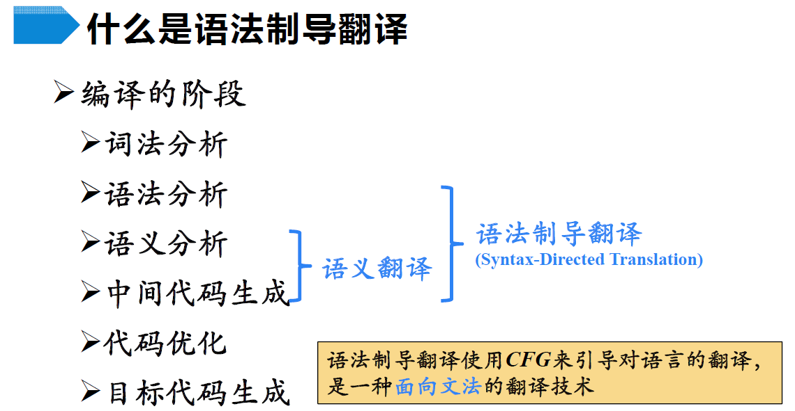
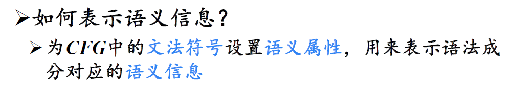
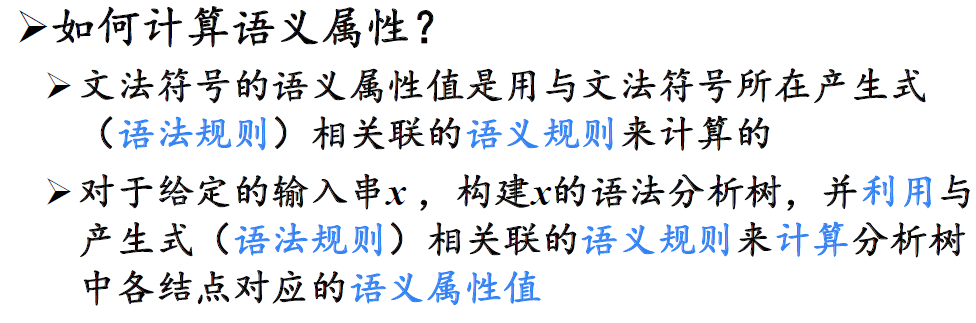
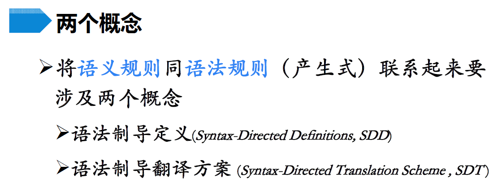
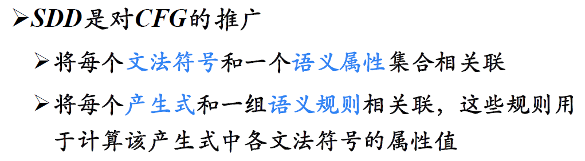
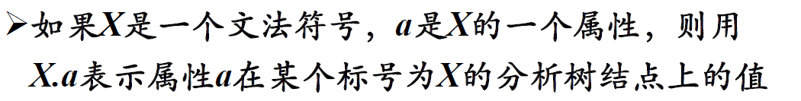
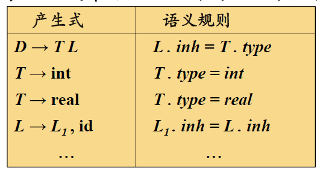
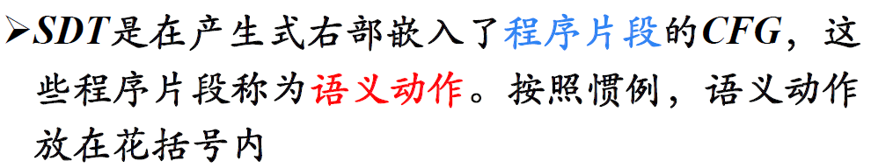
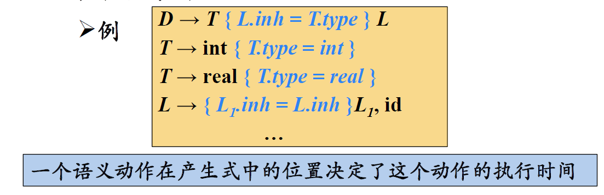
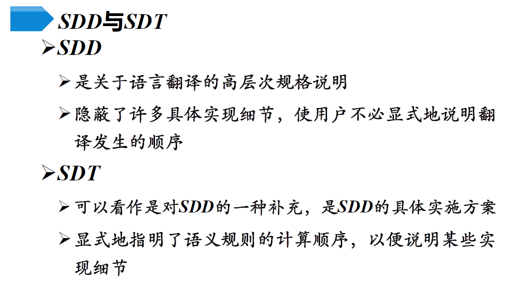

# 语法制导翻译

## 概述

### 1 什么是语法制导翻译

### 2 基本思想

表示语义信息：

- 类型
- 值
- 地址
- …

计算**语义属性**：

### 3 两个概念

- SDD：

  - 对CFG的推广

    

    > 
    >
    > 举例：
    >
    > 

- SDT：

  

  > 举例：
  >
  > 

对比SDD与SDT：

