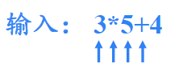

# 语法制导翻译

## 概述

### 1 什么是语法制导翻译

### 2 基本思想

表示语义信息：

- 类型
- 值
- 地址
- …

计算**语义属性**：

### 3 两个概念

- SDD：

  - 对CFG的推广

    

    > 
    >
    > 举例：
    >
    > 

- SDT：

  

  - 程序片段放在右部，但具体不一定放在哪个位置

  > 举例：
  >
  > 

对比SDD与SDT：

## 语法制导定义

> 

### 1 文法符号的属性

*综合属性：*

- 非终结符的综合属性：

  

  > 

- 终结符的综合属性：

  

  > 由词法分析器提供

---

*继承属性：*

- 非终结符的继承属性：

  

  > 

- 终结符没有继承属性：

  

---

*举例：*

- 带有综合属性的SDD

  

  > 有时语义规则的目的是产生**副作用**，比如打印语句，语义规则会写成**过程调用**的形式，可以看成是在定义产生式左部的虚综合属性，因为用到了子结点的属性值；
  >
  > `digit.lexval`是词法分析器提供的词法值

  

- 带有继承属性L.in的`SDD`

  

  > 这里T的属性还是综合属性，L的属性是**继承属性**；
  >
  > `id.lexeme`是词法分析器提供的词法值，表示构成id的字符序列；
  >
  > 副作用`addtype`的功能是在符号表中为`id.lexeme`创建一条**记录**，并将其**类型**设置为`L.inh`，也可以看成虚综合属性

  

### 2 属性文法

> 举例：
>
> 

### 3 SDD的求值顺序

> 

顺序的重点在于**依赖关系**

---

*依赖图：*

> 举例：
>
> 
>
> - 继承属性在左边，综合属性在右边
> - 虚结点：之前据说的虚综合属性，图中的由自身属性和子id结点共同定义

- 根据依赖图计算属性：拓扑排序

  

  > 举例：
  >
  > 

- 综合属性与继承属性的求值顺序规律：

  

  > 举例：
  >
  > 
  >
  > 如果图中没有**环**，那么至少存在一个**拓扑排序**

### 4 SDD的属性定义

#### 4.1 S-属性定义

- 

> 举例：
>
> 

#### 4.2 L-属性定义

- 子结点不能依赖父结点的**综合属性**，不然可以造成循环依赖
- 

> 举例：
>
> 
>
> 

## 语法制导翻译方案

> 

### 1 将S-SDD转换为SDT/S-SDD的自底向上翻译

- 综合属性要在子结点分析完后才能计算，所以**计算综合属性的语义动作/程序片段**要放在产生式的**最右边**

> 

在LR过程中实现SDT，也就是==**规约**时执行语义动作==，**<u>在规约时计算属性值</u>**：

> 举例：
>
> 

---

*扩展LR语法分析栈：*

- 属性值要么是**<u>语义分析器规定的</u>**某些终结符的值，要么是**<u>在规约时计算</u>**出来的

- 如果属性值的大小没有限制，或者数量过多没有限制，最好使用**指针**

- **语义动作与栈操作**的对应关系举例：

  

举例：

> 没有语义动作意思其实是**属性值不变**

### 2 将L-SDD转换为SDT

- ==继承属性会在即将出现时进行计算==，因为这个继承属性要么依赖父结点的继承属性，要么依赖左边符号的属性值，或者依赖于自己的属性

> 举例：
>
> 

> 

后面就会介绍这些内容

### 3 在非递归的预测分析过程中进行翻译(L-SDD)

*扩展语法分析栈：*

- 继承属性在即将出现时计算，存放在**与A平行的记录**中

- 综合属性在子结点分析完后计算，要**新增一条综合记录**存放

  > A对应的综合记录就在与A平行的记录之下

- 还要增加一种**动作记录**，指向要执行的动作

---

*举例：*

- 先将语义动作起别名

  

  - 这可以看成特殊的CFG，新增了一种符号，叫**动作符号**

1. T出栈，但Tsyn不能出栈（因为还没算出来），对应**产生式右部**进栈，对应的**综合记录和动作记录**也入栈

   

2. F出栈，同样方式入栈

3. digit遇到输入符，正常出栈并消耗输入，同时需要将综合属性值copy到后面的动作a~6~中

   

4. digit出栈后，栈顶为动作记录，直接执行计算综合记录属性值，存放到后面的Fsyn综合记录中即可

   > 之前F出栈的时候，Fsyn没出，而Fsyn又刚好在F下，所以这时会刚好在a~6~下

   

5. Fsyn出栈之前要将**综合属性值传递**给后面的动作，后面计算时会用到

   

6. a~1~正常进行计算，T’也可以按照产生式出栈，同时要传递综合属性值给动作a3

   

   

7. *匹配，F推导，同样的出栈，传递属性值，计算属性值

   

   

8. T’推导，传递，计算，copy，出栈

   

   

   

总结传递属性值问题：

> 属性值的处理其实就是语义动作的处理，因为**属性值问题已经解耦交给语义动作**了

**出栈时执行代码**的确定，也就是**传递属性值**问题：

- 注意这里位置的判断，也就是top的计算，产生式右部是**从右向左入栈**
- 同一个符号在不同的产生式中，执行代码也可能是不同的

### 4 在递归的预测分析过程中进行翻译(L-SDD)

将**非终结符对应的过程**扩展为函数，参数就是继承属性，返回值就是综合属性，同时**主函数**也要修改

主函数：

总结算法：

- 词法单元就是终结符+属性值

### 5 L-SDD的自底向上翻译

> S-属性定义语义动作都在右部最后，可以规约时执行，很适合自底向上。而L-属性定义的语义动作可以出现在右部中间，就需要**修改文法**才能制导翻译了

**标记非终结符**：

- 注意体会上图中的修改方式，`inh`对应到了`i`，再对应到`syn`
- 
- <u>可以证明</u>：**如果一个文法是LL的，那么标记非终结符可以插入到产生式的任何位置，并且得到的文法是LR文法**

- 这里很迷，就是`*FNT'`会被规约成`T'`，`T'`的继承属性其实就是`M`的`T'inh`，所以可以直接算出`N`
- `T'.inh`是由产生式中紧靠`T'`左侧的标记非终结符对应的动作计算的，所以综合属性值就在当前栈顶

执行代码：

- M只出现在F的右侧，所以规约出M时F一定在栈顶，一定能计算M的属性值，不然就出错了，N相对于F也是如此
- N还需要T’的继承属性，T’的继承属性是M计算的，M一定会出现

> 讲得乱七八糟的

总结：

