# 运行存储分配

## 运行存储分配概述

### 1 运行存储分配策略

静态存储分配：

动态存储分配：

### 2 运行时内存划分

运行时内存的划分：

活动记录的概念：

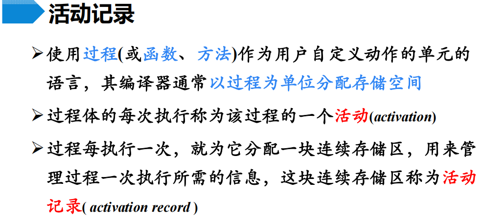

活动记录的一般形式：

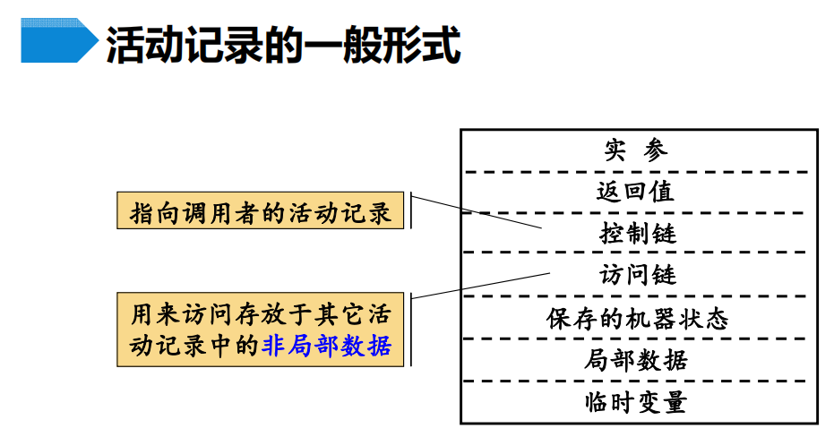

>   临时变量对应于**中间代码生成**时需要的**临时变量**

## 静态存储分配

### 1 过程的静态存储分配

规则：

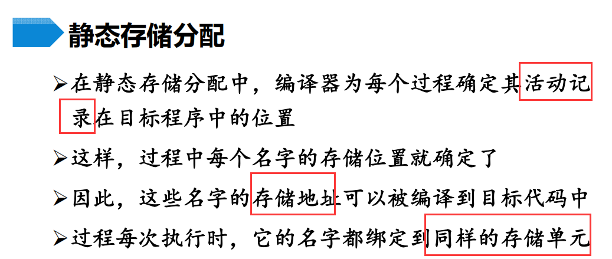

限制：

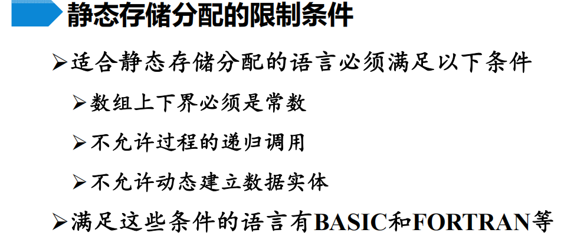

-   如果是递归调用的，无法确定该过程有多少个**活跃的活动记录**，也无法为这些活动记录分配地址空间
-   总得来说，就是**没有运行时的存储分配机制**

### 2 顺序分配法

>   

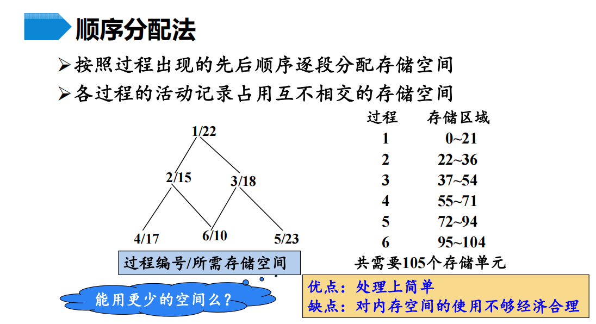

>   这里其实也不是严格按执行顺序分配，主要理解“静态”和“互不相交”即可；
>
>   可以使用**覆盖**技术减少空间的使用，也就是接下来讲的**层次分配法**

### 3 层次分配法

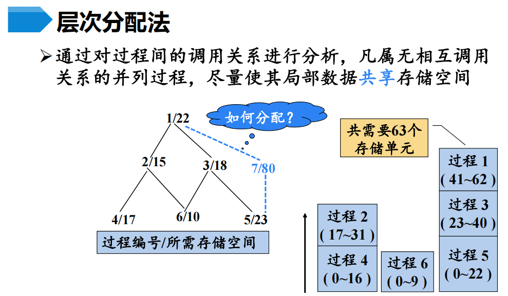

-   没有**递归调用**，这个过程调用图中不会出现**环**
-   可以**从下至上**分配，同层可以互相“覆盖”；上层从子过程的中的最“高”地址开始分配

层次分配算法：

-   过程调用关系矩阵：

    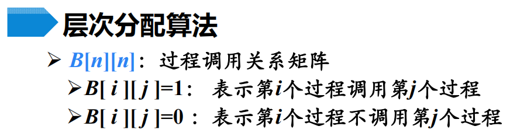

    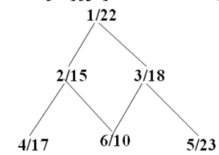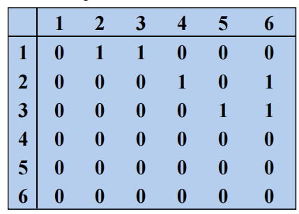

-   内存量矩阵

    

-   算法流程：

    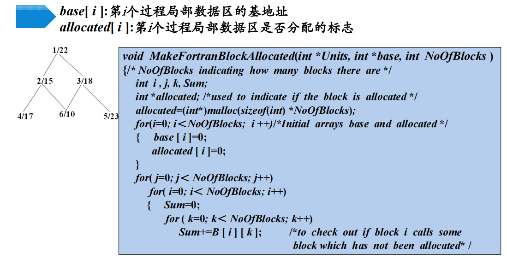

    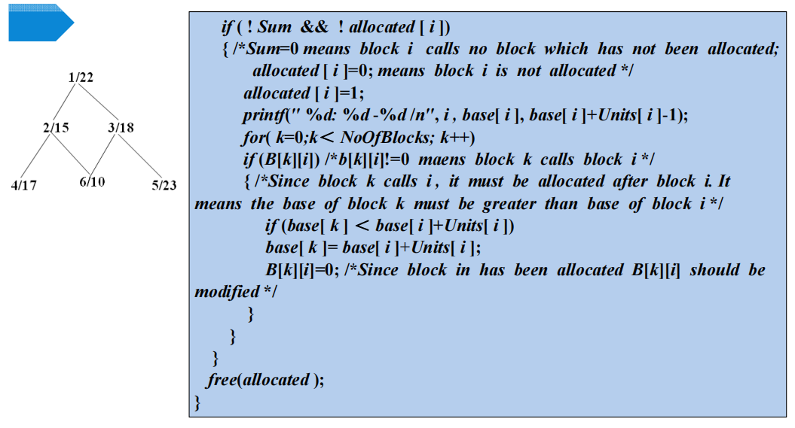

## 栈式存储分配

### 1 概念

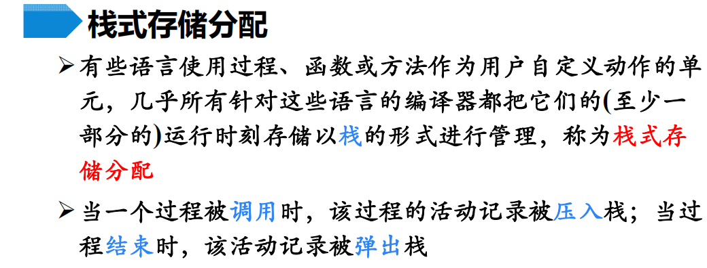

优点：

>   下面会解释这个特点

### 2 活动树

