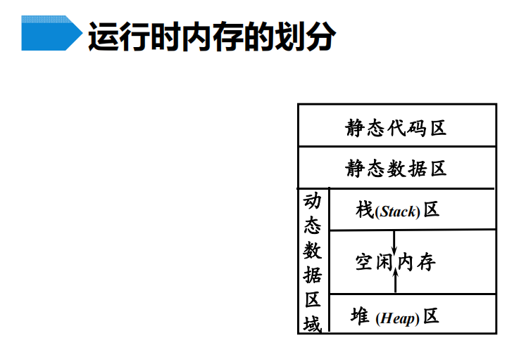
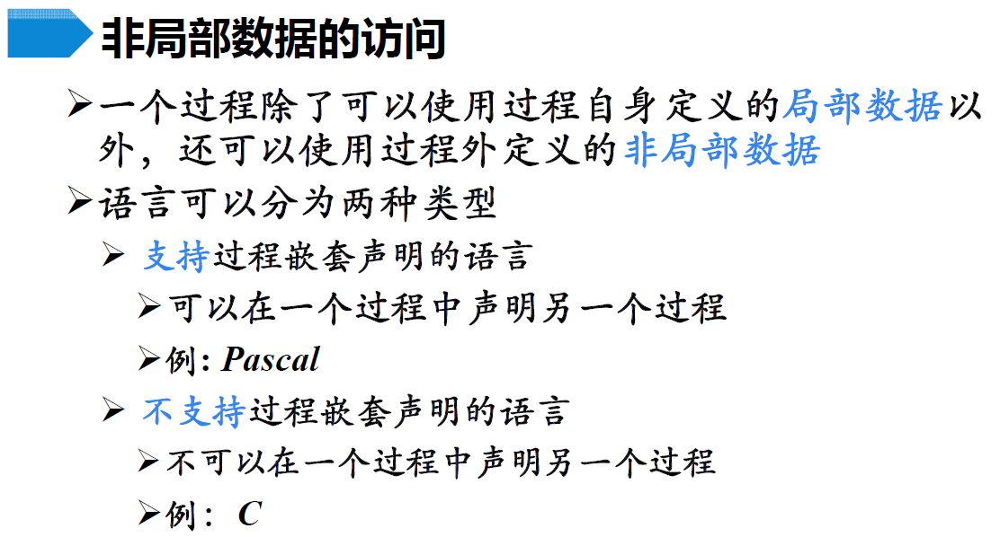

# 运行存储分配

## 运行存储分配概述

### 1 运行存储分配策略

静态存储分配：

动态存储分配：

### 2 运行时内存划分

运行时内存的划分：

活动记录的概念：

活动记录的一般形式：

>   临时变量对应于**中间代码生成**时需要的**临时变量**

## 静态存储分配

### 1 过程的静态存储分配

规则：

限制：

-   如果是递归调用的，无法确定该过程有多少个**活跃的活动记录**，也无法为这些活动记录分配地址空间
-   总得来说，就是**没有运行时的存储分配机制**

### 2 顺序分配法

>   

>   这里其实也不是严格按执行顺序分配，主要理解“静态”和“互不相交”即可；
>
>   可以使用**覆盖**技术减少空间的使用，也就是接下来讲的**层次分配法**

### 3 层次分配法

-   没有**递归调用**，这个过程调用图中不会出现**环**
-   可以**从下至上**分配，同层可以互相“覆盖”；上层从子过程的中的最“高”地址开始分配

层次分配算法：

-   过程调用关系矩阵：

    

    

-   内存量矩阵

    

-   算法流程：

    

    

## 栈式存储分配

### 1 概念

优点：

>   后面讲到非局部变量时会解释这个特点

### 2 活动树

举例：快排的活动树

> 用首字母代表活动

### 3 控制栈

举例：快排活动出入栈

- 当一个过程是递归的时候，常常会有该过程的多个活动记录同时出现在栈中

**活动树和栈**的关系：

### 4 设计活动记录的原则

## 调用序列与返回序列

### 1 概念

### 2 工作流程

注意topsp的位置，是在局部数据上，而不是真的栈顶

- 组成部分
- 存参数的
- 存返回地址的
- 存top-sp的
- …

- 返回值
- 存topsp的
- 返回地址的
- …

### 3 任务划分

调用者：

- 参数
- 控制链
- 保存的机器状态中的PC值（返回地址）
- 更新topsp
- （设置访问链）

被调用者：

- 返回值
- 其他机器状态
- 恢复topsp

### 4 变长数据的存储分配

动态数组举例：

- 变长数组虽然出现在栈中，但它们并不是活动记录的一部分。

  > **编译时能确定大小的才是活动记录中的部分**，比如那个数组指针。而变长数组是在运行时才分配的

## 非局部数据的访问

### 1 概念

过程嵌套举例：

不支持过程嵌套举例：

### 2 非局部数据的访问

不支持过程嵌套的：

#### 2.1 嵌套深度

支持过程嵌套的：

嵌套深度定义：

#### 2.2 访问链

访问链使用举例：沿着访问链访问外围数据

### 3 访问链的建立

> 注意，外层调用内层不能直接调内层的内层，因为看不到，只能调在自己内部定义的一级内层

- 外调内，复制外到内

- 同级调，访问相同直接复制

> 内调外是可以跨好多级的

- 内调外，访问最近公共祖先（不包括二者本身）

## 堆式存储分配

### 1 概念

### 2 分配与释放策略

### 3 堆式管理的条件

## 符号表

### 1 概述

- 记录标识符和标识符的属性信息

### 2 数据结构

### 3 访问与访问链

构造访问链的时候也需要用到符号表信息，创建新的活动记录时，先在调用者的符号表中找，如果在自己的符号表中找到了，就直接把新的活动记录的访问链设置为调用者，如果在自己的符号表找不到，则沿着访问链到新的符号表，直到某个符号表中有这个过程名，则把新活动记录的访问链设置为这个符号表对应的活动记录

### 4 符号表对标识符的处理

### 5 嵌套过程声明语句的SDT/符号表的建立

举例：

先写出了这个程序的概括版

举例：

（这段我没看，之后有空再说吧）

